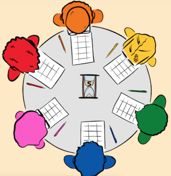

Die 6_3_5_Methode ist eine Brainwriting-Kreativitätstechnik. Hierbei erhalten 6 Personen einen Zettel, auf welchen sie jeweils 3 weitere Ideen zu einem vorab definierten Thema schreiben. Dieser Zettel wird 5-mal weitergegeben und jeweils ergänzt.[^1]

*6_3_5-Methode*[^3]

# Einführung

Sie ist dem [Brainstorming](https://en.wiktionary.org/wiki/brainstorming) sehr ähnlich. Es können hierbei in wenigen Minuten bis zu 108 Ideen gesammelt werden. Eine mündliche Absprache gibt es während des Ablaufes nicht.[^2]

# Vorgehen

Die 3_6_5 Methode läuft wie folgt ab:

| Schritt   | Erläuterung | 
| ------------- | ------------- |
| Einführung  | Erklärung der Methode für die Teilnehmer*innen, Definition der Problemstellung  |
| 1. Runde  | 2-5 Minuten Zeit für 3 Ideen; Dieses sollen knapp und verständlich auf dem Vordruck aufgeschrieben werden  |
| 2. Runde  | Ebenfalls 2-5 Minuten Zeit; Der Vordruck wird im Uhrzeigersinn weitergegeben; Die Ideen dürfen modifiziert, erweitert oder ergänzt werden|
| Folgende Runden| Vorgehen wie in der 2. Runde; Bei Bedarf Erweiterung der Zeit möglich, um vorherige Ideen lesen zu können |

*Abbildung: Vorgehen bei der 6_3_5-Methode*[^2]

# Vor- und Nachteile der 6_3_5-Methode

## Vorteile

Die Verwendung der Methode bietet verschiedene Vorteile, darunter[^2][^4]:

* Vermeidung von Spannungen im Team während der Ideenfindung
* Alle Teilnehmer*innen werden gleichermaßen aktiv, somit bringt sich jeder ein und die Lösungsvorschläge sind vielfältig
* Kreativitätssteigerung durch Aufbau auf bereits geschriebene Ideen möglich
* Größere Gruppe können in kleine 6er-Gruppen aufgeteilt werden, die Methode ist auch für große Teams anwendbar
* Ideen werden von der Person getrennt, die objektive Bewertung wird sichergestellt

## Nachteile

Schwächen der 6_3_5-Methode sind die Folgenden[^6]:

* Doppelungen nicht ausgeschlossen (Kann jedoch gegebenenfalls für die Gewichtung herangezogen werden)
* Rücksprache bei Verständnisproblemen die die Ideen betreffen während der Methode nicht möglich

# Außerdem wissenswert

Die 3_6_5-Methode ist eine kreativ-intuitive Methoden und basiert auf Assoziation. Assoziation beschreibt automatische Denkvorgänge. Spontanität und Leichtigkeit sind von Bedeutung, die Ergebnisse müssen nicht von Anfang an perfekt sein.[^5]

Die Zeit pro Runde wird vorab festglegt. Hierbei wird meistens ein Zeitraum von zwei bis fünf Minuten empfohlen.[^2][^5]

Die Methode wurde erstmals 1969 vom Unternehmensberater Bernd Rohrbach erwähnt.[^6]

# Siehe auch

* [Ideen_Marathon](Ideen_Marathon.md)
* [Walt_Disney_Methode](Walt_Disney_Methode.md)

# Weiterführende Literatur

* Christian Schawel, Fabian Billing (2009): "Top 100 Management Tools"
* Joachim H. Becker, Helmut Ebert, Sven Pastoors (2018): "Praxishandbuch berufliche Schlüsselkompetenzen"

# Quellen

[^1]: https://kreativitätstechniken.info/ideen-generieren/6-3-5-methode/
[^2]: [Christian Schawel, Fabian Billing (2009): "Top 100 Management Tools"](https://link.springer.com/content/pdf/10.1007%2F978-3-8349-8185-1.pdf)
[^3]: https://image.jimcdn.com/app/cms/image/transf/none/path/s5acfc1d9f29c1cb7/image/i8720fe90f8a0a609/version/1550965221/image.png
[^4]: https://denkmotor.com/kreatives-wissen/brainwriting-6-3-5-methode/
[^5]: [Joachim H. Becker, Helmut Ebert, Sven Pastoors (2018): "Praxishandbuch berufliche Schlüsselkompetenzen"]https://link.springer.com/content/pdf/10.1007%2F978-3-662-54925-4_11.pdf
[^6]: https://www.hs-osnabrueck.de/fileadmin/HSOS/Homepages/LearningCenter/Dateien/Toolbox/Dokumente_mit_neuer_Bezeichnung/635-Methode_zur_Veranstaltungsevaluation.pdf
