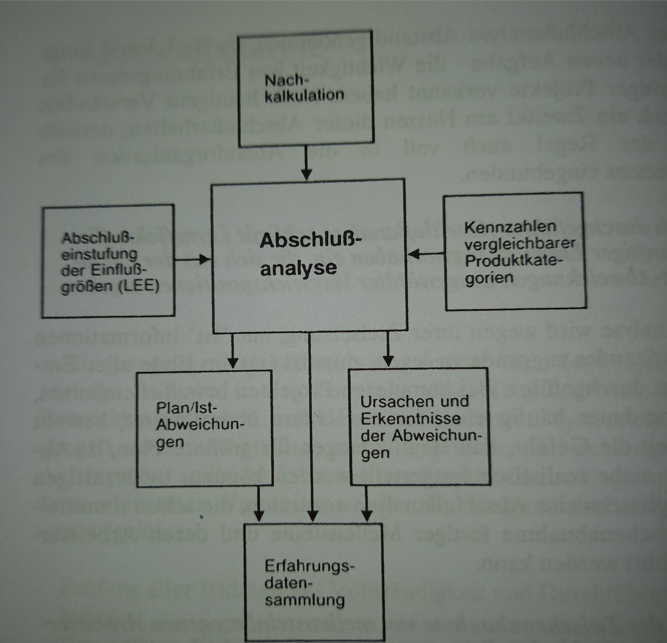

Um ein Projekt bewerten zu können gehört dazu eine Abschlussanalyse, um festzustellen, ob das Projekt erfolgreich durchgeführt oder insgesamt das Ziel verfehlt wurde. 
Die Abschlussanalyse wird wegen ihrer Zielsetzung, nur "Ist"-Informationen eines endgültigen Standes zugrunde zu legen, zumeist erst am Ende aller 
Entwicklungsaufgaben durchgeführt[^1]. Dieser Beitrag soll aufklären, welche Inhalte für die Abschlussanalyse wichtig sind für die Bewertung des gesamten Projektes.

Allgemein wird bei einer Abschlussanalyse ein Soll-Ist Abgleich für Projektziele, -ergebnisse, -zeit und -qualität durchgeführt. Des Weiteren muss ein 
Abschlussbericht erstellt und an dem Auftraggeber übergeben werden. Abschließend wird eine Abschlusskostenkalkulation und zusätzlich eine 
Wirtschaftlichkeitsbetrachtung erledigt[^2].

Zu Beginn werden Kennzahlen vergleichbarer Produktkategorien benötigt, um sie mit den Messzahlen des abgeschlossenen Projektes abgleichen zu können. Durch den 
Vergleich treten in der Regel Abweichungen hervor, deren Ursachen man danach untersucht.
Es gibt personelle, technische oder auch organisatorische Ursachen für Abweichungen. Zum Beispiel kann als technische Abweichungsprobleme schlechte Testdaten sein, 
aber es kann auch vorkommen, dass es sich auch um nicht vermeidbare Ursache handelt, wie beispielsweise die Fremdteile, die man von einem externen Unternehmen 
bezieht, sind fehlerhaft und führen deshalb zur Abweichung[^3].
Beim Soll-Ist-Abgleich wird eine Nachkalkulation – möglichst in derselben Struktur wie bei den vorausgegangenen Vor- und Mitkalkulationen – durchgeführt. Hierzu 
werden die ursprünglichen Berechnungen (aus der Ursprungsplanung) den tatsächlichen Werten für Aufwand, Umfang und Kosten gegenübergestellt. Unterschiede bezüglich 
der Termine und Kosten beim Material sowie der Leistungs- und Qualitätsmerkmale sind hinsichtlich ihrer Ausprägung, Ursachen und möglichen Abhilfen im Rahmen einer 
Abweichungsanalyse zu untersuchen[^4].
Bei komplexen Projekten bzw. Teileinheiten, deren Entwicklungsdauer häufig ein oder zwei Jahre überschreitet, besteht nach so langer Zeit die Gefahr, dass 
Begründungen für größere Plan/Ist-Abweichungen nicht mehr realistisch festgestellt werden können.  In derartigen Fällen wäre eine phasenweise Abschlussanalyse 
anzuraten, die schon unmittelbar nach der Zwischenabnahme fertiger Meilensteine und deren Arbeitsergebnisse durchgeführt werden kann[^3].
Es sollte zwar nur die wesentlichen Einheiten benannt werden, allerdings müsste auch der Leistungsgrad und der dazugehörige Qualitätsaufwand erkennbar sein[^3].
Der Vergleich mit den ersten Planstand kommt die größere Bedeutung zu, da bei einer im Prozessablauf stetig durchgeführten Plankorrektur ein Vergleich mit dem 
letztgültigen Planstand nur noch geringe Abweichungen aufweisen würde[^3].
Im Bereich der Forschung und Entwicklung kann durch Gewinnung objektiver Kennzahlen anhand der Erfahrungsdaten und Messzahlen vieler Entwicklungsabschlüsse im 
Zeitreihenvergleich auch eine Annäherungsrechnung zum erzielten Produktivitätsfortschritt durchgeführt werden. Der Hauptvorteil der Abschlussanalysen und daraus 
aufgebauter Erfahrungsdaten liegt in der Organisation eines breit angelegten Zugriffs zu diesen Daten, der in größeren der in größeren F&E-Abteilungen zu einem 
rechnergestützten Wissenstransfer ausgebaut werden kann[^3].
Eine wichtige Komponente bei einer Abschlussanalyse sind Erfahrungsdaten. Diese geben nämlich eine wesentliche Orientierungshilfe. Im Schätz- und 
Beurteilungsprozess wird das subjektiv vorhandene Erfahrungswissen durch systematisch gesammelte und ausgewertete Erfahrungsdaten ergänzt. Mithilfe einer (am besten 
computergestützten) Datenbank sind Erfahrungsdaten schneller und leichter auswertbar. 
Die abschließende Bewertung des Projekts sollte dann anhand von vorab festgelegten Kriterien erfolgen. So kann es beispielsweise sind, dass eine Abweichung von bis 
zu 10 % bei allen Zielgrößen als “gutes Ergebnis” gesehen wird[^1]. 

Zusammenfassend hat die Plan-/Istkostenvergleich (bzw. Soll-Ist Abgleich) einen sehr großen Anteil an der Abschlussanalyse, aber man darf auch nicht die anderen Aspekte vernachlässigen. 

* Verlinkungen zu angrenzenden Themen
* [Link auf diese Seite](Abschlussanalyse.md)
 
# Quellen

[^1]: (https://www.peterjohann-consulting.de/projektabschluss/#21_der_projektabschlussbericht)
[^2]: (https://www.consulting-life.de/projektabschluss/)
[^3]: Riedl, J. (1990) Projekt-Controlling in Forschung und Entwicklung
[^4]: (https://de.wikipedia.org/wiki/Projektabschluss)

