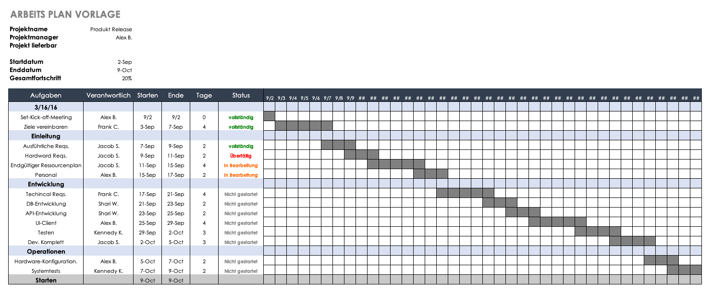

Ein Projekt zu planen und zu überwachen, sodass sowohl Erwartungen als auch Zeitpläne und Budgets eingehalten werden können, ist eine herausfordernde Aufgabe. Hierbei können leicht verschiedene Punkte vergessen werden. Um dies zu verhindern kann auf unterschiedliche Tipps bzw. Best Practices zurückgegriffen werden, im Folgenden werden von diesen einige grundsätzliche Best Practices ausgeführt. 

## 1. Frühzeitige und regelmäßige Kommunikation mit allen Stakeholdern:
Von [Projektstart](kb/Projektstart.md) an sollten alle Stakeholder im Rahmen des [Stakeholdermanagements](kb/Stakeholdermanagement.md) über Ziele und aktuelle Zwischenstände des Projekts regelmäßig informiert werden. Zu den Stakeholdern gehören beispielsweise die Teammitglieder, Manager oder auch Externe wie Kunden.[^1] 

## 2. Kommunikation von Auswirkungen bei Erweiterung des Projektumfangs:
Direkt an Punkt 1 schließt sich die Kommunikation bei Erweiterungen des Projektumfangs an. Oft ergeben sich während des Projekts neue Anfragen von Stakeholdern, bspw. dem Vorstand, die Auswirkungen auf Zeitplan und Budget haben können. Auch hier sollte frühzeitig mit allen Stakeholdern kommuniziert werden, um Konflikten vorzubeugen und bei allen ein klares Verständnis über sich ergebende Abweichungen durch Erweiterung des Projektumfangs zu schaffen. 

## 3. Betreiben von Risikomanagement:
Im Projekt ist es sehr wichtig mögliche Risiken zu identifizieren, einzuschätzen wie sich diese auf das Projekt auswirken können und daraus geeignete Maßnahmen zu entwickeln. Hierdurch sollen Kostenexplosionen als auch Sprengungen des Zeitplans vermieden werden. Beim [Risikomanagement](kb/Risikomanagement.md) im Projekt sollten daher sowohl feste Eskalationspläne als auch Stärkegrade für Probleme etabliert werden. Beide haben das Ziel bei der Bewältigung von Problemen zu helfen, in der Praxis hat sich nämlich gezeigt, dass wichtige Stakeholder oft zu spät über Komplikationen informiert werden. Durch das Risikomanagement sollen neben Risiken aber auch Chancen identifiziert werden.  Durch Wahl richtiger Schritte können ihre Eintrittswahrscheinlichkeit wiederum erhöht werden. 

## 4. Detaillierter Projektplan:
Der Projektplan soll zur Organisation von Aufgaben und Verantwortlichkeiten dienen. Hierzu sind neben Zeit, Budget und Umfang auch Ziele und Probleme in die Planung zu integrieren. Bei der Verteilung von Aufgaben auf Ebene einzelner Arbeitspakete ist es wichtig darauf zu achten, dass diese in vorgegebener Zeit erledigt werden können.  Überarbeitung und Demotivation können dadurch verhindert werden. Ein ständiges Monitoring des Projektfortschritts ist hierfür hilfreich.[^2]

## 5. Schriftliche Dokumentation:
Das schriftliche Festhalten von allen Informationen ist in einem Projekt ein sehr wichtiges Instrument um sicherzustellen, dass den Stakeholdern für sie relevante Daten zur Verfügung stehen. Des Weiteren kann die Dokumentation von Projektfortschritten später dazu dienen Entscheidungen zu treffen oder nachzuvollziehen, warum bestimmte Entscheidungen getroffen wurden.[^3] 

## 6. Definierte Start- und Endpunkte:
Zu Beginn eines Projekts sollte eine Kick-Off-Veranstaltung abgehalten werden. Das bietet die Gelegenheit alle Projektbeteiligten zu versammeln, sich kennenzulernen und auf das gemeinsame Arbeiten einzustimmen.[^2] Nach dem Projektende wiederum ist der Moment erreicht, an dem es Zeit ist zu analysieren wie das Projekt abgelaufen ist, welche Fehler gemacht worden sind und was gut gelaufen ist. Hier sollten erneut alle Projektbeteiligten in einer Besprechung zusammengebracht werden, um deren Ansichten über Erfolge und Misserfolge zu sammeln. Ziel ist es die „Lessons learned“ zu nutzen, um nächste Projekte zu optimieren und ggf. neue Best Practices zu formulieren. Dadurch können idealerweise auch Kosten und Zeit gespart werden.[^1]

## Quellen

[^1]: https://www.wrike.com/de/blog/10-best-practices-im-projektmanagement/
[^2]: https://www.pebco.ag/impuls/projektmanagement-9-best-practices-zur-steigerung-der-erfolgschancen-ihrer-projekte/ 
[^3]: https://www.wrike.com/de/blog/projektmanagement-best-practices-infografik/

