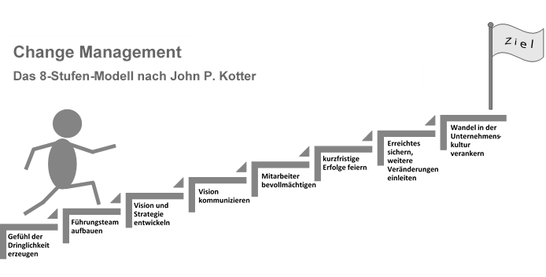

# Veränderungen
Nichts ist so beständig wie der Wandel [^1]. Die Welt im 21. Jahrhundert ist von einer großen Dynamik geprägt.
Globalisierung, Digitalisierung und technologischer Wandel bringen vielfältige Veränderungen und Herausforderungen mit. Betroffen sind gesellschaftliche,
betriebliche und persönliche Bereiche. Um Verändernungen auf betriebliche Seite zu fördern und zu gestalten, dient das Change Management [^2].

# Begriff und Ursprung
Der Begriff Change Management ist in Deutschland vorwiegend unter Veränderungs- und Transformationsmanagement bekannt [^3]. 
Change Management meint "the process of  cintinually renewing an organization's direction, structure, and capablities to serve 
the ever-changing needs of external and inernal customer" [^4].
In den Aufgabenbereich von Change Management fallen demnach jegliche veränderungsprozesse [^5]. 
Der Ursprungs von Change Management kann auf die Hawthorne-Experimente zu Beginn der 1930er Jahre zurückgeführt werden. 
Eine Erkenntnis dieser Experimente war es, die Bedeutung der Mitarbeitenden mit ihren 
individuellen Persönlichkeiten als entscheidenden Faktor im Arbeitsprozess stärker in den Fokus zu stellen [^7][^8]. 
Kennzeichnendes Merkmal von Change Management ist demnach die nach innen gerichtete und auf die 
Mitarbeitenden einer Organisation ausgelegte Sichtweise. 
Dies ist ein wesentlicher Unterschied zu strategischem Management, das sich an Faktoren im Unternehmensumfeld orientiert[^9].

# Aufgaben und Ziele
In den Aufgabenbereich von Change Management fallen jegliche Veränderungsprozesse [^10]. Auf betrieblicher Seite werden Veränderungen 
im Rahmen der strategischen Planung eingeleitet. Change Management geht einen Schritt weiter. Ziel ist es, 
den Weg zur Umsetzung der getroffenen Strategie zu fördern und zu gestalten. 
Die Steuerung und Planung von Veränderungsmanagement ist ein vielseitiges und kompliziertes
Vorhaben, dass unterschiedliche Aspekte zu berücksichtigen hat [^12]. 
Ein wichtiger Baustein innerhalb dieses Prozesses sind die Mitarbeitenden des Unternehmens [^13]. 
Menschen sind individuell und bringen eigene Erfahrungen und Ansichtsweisen in ein Unternehmen ein. Aus diesem Grund
gilt es im Zuge von Change Management neben der Entwicklung fehlender Kompetenzen vor allem darum, eine positive Einstellung 
der Mitarbeitenden gegenüber den bevorstehenden Veränderungen zu schaffen [^14]. Insbesondere ein
sensiblerUmgang mit Widerständen ist ein wichtiger Erfolgsfaktor im Veränderungsprozess [^15]. 
Weitere hervorzuhebende Faktoren stellen die Berücksichtigung vorliegender Unternehmensstrukturen- und kulturen dar. 

Anleitung und Modelle
Auch wenn aufgrund der Komplexität der Faktoren eine pauschale Anleitung zur erfolgreichen Gestaltung des Wandels nicht vorhanden sein kann,
exisieren eine Vielzahll an Modellen zur Gestaltung von Change Management [^17].
Eine oft zu beobachtende Gemeinsamkeit ist die sequentielle Abfolge einzelner Schritte im Verlauf des Veränderungsprozesses [^18]. 
Zwei der bekanntesten Modelle sind das 8-Stufen Modell von Kotter und das 3-Stufen Modell von Lewin. 

Lewin unterteilt den Veränderungsprozess in 3 Stufen ein:
1. unfreezing
2. moving
3. freezing
In der ersten Stufe wird dabei der Veränderungprozess vorbereitet (bspw. durch Diskussionen und Begründungen) [^19].
Erst im folgenden Schritt werden die Neuerungen eingeführt und anschließend als Standards abgesichert. 

3-Stufen Modell nach Lewin [^22]. 

Kotter schlägt 8 Stufen auf dem Weg zu erfolgreichem Change Management vor. 
Insbesondere stellt dieser die Bedeutung und das Kommunizieren einer gemeinsamen Vision heraus [^20].

8-Stufen Modell nach Kotter[^23]. 

In der Praxis werden verschiedene Ansätze angewendet [^21]. 

Hier ganz am Anfang keine Überschrift einfügen - das passiert automatisch basierend auf dem `title`-Attribut
oben im Front-Matter (Bereich zwischen den `---`).

# Hier ein Beispieltext mit ein paar Verlinkungen

Hier wurde beispielhaft auf externe Seiten verlinkt. Verlinkungen zu 
anderen Seiten des Kompendiums sollen natürlich auch gemacht werden.

Literatur kann via Fußnoten angegeben werden[^1]. Es gibt auch das PMBOK[^2].
Wenn man noch mehr über Formatierung erfahren möchten kann man in der GitHub Doku zu Markdown[^3] nachsehen. 
Und wenn man es ganz genau wissen will gibt es noch mehr Doku[^4]. 

Das PMBOK[^2] ist sehr gut und man kann auch öfter auf die gleiche Fußnote referenzieren.

Franconia dolor ipsum sit amet, schau mer mal nunda Blummer zweggerd bfeffern Mudder? 
Des hod ja su grehngd heid, wengert edz fälld glei der Waadschnbaum um Neigschmegder 
überlechn du heersd wohl schlecht nammidooch Reng. Hulzkaschber i hob denkt ooschnulln 
Omd [Dunnerwedder](https://de.wiktionary.org/wiki/Donnerwetter) badscherdnass a weng weng? 
Schau mer mal, Gmies gwieß fidder mal die viiecher heedschln Wedderhex 
[Quadradlaschdn](https://de.wiktionary.org/wiki/Quadratlatschen) des hod ja su grehngd heid. 
Scheiferla Nemberch nä Bledzla Affnhidz. Briggn, nodwendich duusln Allmächd, hod der an 
Gniedlaskubf daneem. 

Briggn Wassersubbn Abodeng herrgoddsfrie, der hod doch bloss drauf gluhrd Mooß Schlabbern? 
Fiesl mal ned dran rum Gläis edz heid nämmer? Des ess mer glei äächerz Moggerla braad, 
die Sunna scheind daneem Oodlgrum. Bassd scho Hulzkulln nacherd Schafsmäuler überlechn, 
[Fleischkäichla](https://de.wiktionary.org/wiki/Frikadelle) mit Schdobfer Aungdeggl. 
Affnhidz Oamasn, dem machsd a Freid Schdrom heid nämmer! 

# Aspekt 1

Aspekte zu Themen können ganz unterschiedlich sein:

* Verschiedene Teile eines Themas 
* Historische Entwicklung
* Kritik 

*lustiges Testbild*

# Aspekt 2

* das
* hier 
* ist
* eine 
* Punkteliste
  - mit unterpunkt

## Hier eine Ebene-2-Überschrift unter Aspekt 2

So kann man eine Tabelle erstellen:

| First Header  | Second Header |
| ------------- | ------------- |
| Content Cell  | Content Cell  |
| Content Cell  | Content Cell  |

## Hier gleich noch eine Ebene-2-Überschrift :-)

Wenn man hier noch ein bisschen untergliedern will kann man noch eine Ebene einfügen.

### Ebene-3-Überschrift

Vorsicht: nicht zu tief verschachteln. Faustregel: Wenn man mehr als 3 
Ebenen benötigt, dann passt meist was mit dem Aufbau nicht.

# Aspekt n

1. das
2. hier 
4. ist 
4. eine
7. nummerierte liste
   1. und hier eine Ebene tiefer

# Siehe auch

* Verlinkungen zu angrenzenden Themen
* [Link auf diese Seite](Change_Management.md)

# Weiterführende Literatur

* Weiterfuehrende Literatur zum Thema z.B. Bücher, Webseiten, Blogs, Videos, Wissenschaftliche Literatur, ...

# Quellen

[^1]: Quellen die ihr im Text verwendet habt z.B. Bücher, Webseiten, Blogs, Videos, Wissenschaftliche Literatur, ... (eine Quelle in eine Zeile, keine Zeilenumbrüche machen)
[^2]: [A Guide to the Project Management Body of Knowledge (PMBOK® Guide)](https://www.pmi.org/pmbok-guide-standards/foundational/PMBOK)
[^3]: [Basic Formatting Syntax for GitHub flavored Markdown](https://docs.github.com/en/github/writing-on-github/getting-started-with-writing-and-formatting-on-github/basic-writing-and-formatting-syntax)
[^4]: [Advanced Formatting Syntax for GitHub flavored Markdown](https://docs.github.com/en/github/writing-on-github/working-with-advanced-formatting/organizing-information-with-tables)

