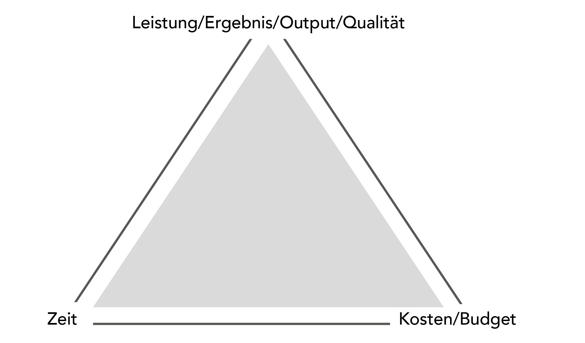

Unterliegt ein Projekt einem ständigen Veränderungs- bzw. Erweiterungsprozess und wurde kein klares Ende definiert so wird dieses im Rahmen des Projektmanagements als „Dauerbaustelle“ bezeichnet.[^1]

„Ein [Projekt](Projekt.md) ist ein Vorhaben, das im Wesentlichen durch Einmaligkeit der Bedingungen in ihrer Gesamtheit gekennzeichnet ist …“. Der temporäre Charakter von Projekten bezeichnet einen Beginn und ein Ende der Projektarbeit.Es wird eine konkrete Zielvorgabe aufgestellt, die ihm Rahmen des Projekts zu erfüllen ist. Außerdem wird für diese Zielerreichung sowohl ein zeitlicher, finanzieller als auch personeller Rahmen gesteckt. Darüber hinaus von zentraler Wichtigkeit ist, dass das Projekt gegenüber anderen Vorhaben sauber getrennt ist.[^2]

Die Überwachung der Einhaltung der verschiedenen Rahmenbedingung eines Projekts liegt im [Projektmanagement](Projektmanagement.md).
Das Projektmanagement beschreibt die Anwendung von Wissen, Fähigkeiten, Werkzeugen und Techniken auf Projektaktivitäten, um die Projektanforderungen zu erfüllen.[^3] 
Das klassische Projektumfeld zeichnet sich dadurch aus, dass die vom Projektmanager definierten Arbeitspakete und Ziele mittels eines definierten Budgets erreicht werden sollen. Die dazu erforderlichen Prozesse im Rahmen der Projektentwicklung sind in der Regel aufeinander folgend gestaltet und häufig werden auch mehrere Projekte parallel bearbeitet.

# Warum wird ein Projekt zur Dauerbaustelle?

Es gibt eine Vielzahl von Fehlerquellen im Projektmanagement die dazu führen können, dass ein Projekt zu einer Dauerbaustelle wird. Häufig werden Projekte nicht innerhalb des dafür vorgesehenen Zeitrahmen abgeschlossen. Beispielsweise weil das Projekt die geplanten Kosten übersteigt oder weil nicht ausreichend personelle Ressourcen zu Verfügung stehen. Auch benötigtes Spezialwissen, welches nicht zur Verfügung steht, kann ein Grund hierfür sein. Mitarbeiter müssen zunächst geschult oder externe Berater eingekauft werden, wodurch sich der Projektbeginn verzögern kann. Es können auch Neuanforderungen an das Projektteam herangetragen werden, welche die Zielsetzung maßgeblich beeinflussen und in zu großem Umfang verändern. Somit werden erarbeitet Zwischenstände möglicherweise unbrauchbar, wodurch das Projektteam zeitlich zurückfällt.[^4] 

Eine andere häufige Ursache von Dauerbaustellen ist, dass Projekte nicht systematisch ausgewählt werden und es dafür an klar definierten Entscheidungskriterien fehlt. 
Im Rahmen des strategischen Managements sollten stehts Gründe für eine Projektpriorisierung angegeben werden. Dies hilft dem umsetzenden Team dabei die entsprechenden Pain Points zu identifizieren und effizienter an einer Lösung zu arbeiten.
Häufig fehlt es aber nicht nur an klaren Entscheidungskriterien, ebenso oft kommt es vor, dass Projekte ohne einen klaren Auftrag gestartet werden. Es existiert kein Projektportfolio und es werden keine Prioritäten festgelegt. Wenn es keine definierten [Meilensteine](Meilensteine.md) gibt, wird es auch schwierig Zwischenergebnisse zu überprüfen und zu bewerten. Je später Fehler erkannt werden, desto aufwendiger wird es die Quellen zu identifizieren und Gegenmaßnahmen einzuleiten. Prozesse müssen gegebenen Falls rückabgewickelt und neugestartet werden wodurch sich der zeitliche Projektrahmen automatisch verlängert.
Mit Verzögerungen ist auch dann zu rechnen, wenn innerhalb der Projektteams [Verantwortlichkeiten](Verantwortlichkeiten.md) nicht klar ausgesprochen werden oder den Beteiligten nicht bewusst gemacht werden. Dies führt unwillkürlich zu häufigeren Rückfragen und einer Verlängerung der Prozesskette. 
Häufige Rückfragen treten auch dann auf, wenn vor Projektbeginn nicht alle notwendigen Berechtigungen eingeholt wurden. Damit das Team ohne unnötige Abhängigkeiten agieren kann sollte der Bedarf noch vor [Projektstart](Projektstart.md) erkannt und an die notwendigen Stellen weitergeleitet werden.
Um all diesen Ursachen vorzubeugen, ist es wichtig dem Projektmanager einen umfangreicher [Methoden](Methoden.md)-Koffer an die Hand zu gegeben, damit dieser ausreichend definierte Arbeitspakete schnüren und Projektaktivitäten ausreichend beeinflussen und steuern kann.[^5]

# Aspekt 1

Aspekte zu Themen können ganz unterschiedlich sein:

* Verschiedene Teile eines Themas 
* Historische Entwicklung
* Kritik 

*[Das magische Projektmanagement Dreieck](Magisches_Dreieck.md)*

# Aspekt 2

* das
* hier 
* ist
* eine 
* Punkteliste
  - mit unterpunkt

## Hier eine Ebene-2-Überschrift unter Aspekt 2

So kann man eine Tabelle erstellen:

| First Header  | Second Header |
| ------------- | ------------- |
| Content Cell  | Content Cell  |
| Content Cell  | Content Cell  |

## Hier gleich noch eine Ebene-2-Überschrift :-)

Wenn man hier noch ein bisschen untergliedern will kann man noch eine Ebene einfügen.

### Ebene-3-Überschrift

Vorsicht: nicht zu tief verschachteln. Faustregel: Wenn man mehr als 3 
Ebenen benötigt, dann passt meist was mit dem Aufbau nicht.

# Aspekt n

1. das
2. hier 
4. ist 
4. eine
7. nummerierte liste
   1. und hier eine Ebene tiefer

# Weiterführende Literatur

* Weiterfuehrende Literatur zum Thema z.B. Bücher, Webseiten, Blogs, Videos, Wissenschaftliche Literatur, ...

# Quellen

[^1]: (https://de.set18.net/wiki/Dauerbaustelle_(Projektmanagement)) 
[^2]: [Projekte zum Erfolg führen: Projektmanagement systematisch und kompakt](https://books.google.de/books?hl=de&lr=&id=lq54DwAAQBAJ&oi=fnd&pg=PT5&dq=Gr%C3%BCnde+schlechtes+Projektmanagement&ots=Y2Yrf9i2l9&sig=D7XHUzi6ZwI2WcvesHrzRCCMoeM#v=onepage&q&f=false)
[^3]: [A Guide to the Project Management Body of Knowledge (PMBOK® Guide)](https://www.pmi.org/pmbok-guide-standards/foundational/PMBOK)
[^4]: [Projekte zum Erfolg führen: Projektmanagement systematisch und kompakt](https://books.google.de/books?hl=de&lr=&id=lq54DwAAQBAJ&oi=fnd&pg=PT5&dq=Gründe+schlechtes+Projektmanagement&ots=Y2Yrf9i2l9&sig=D7XHUzi6ZwI2WcvesHrzRCCMoeM#v=onepage&q&f=false)
[^5]: [Agiles Projektmanagement: Agilität und Scrum im klassischen Projektumfeld](https://books.google.de/books?hl=de&lr=&id=pnHbDwAAQBAJ&oi=fnd&pg=PP1&dq=klassisches+projektmanagement+schulung&ots=eGtJPSLtEK&sig=IFBLf7FJ3bzL_hx-t-XygD2BGnc&redir_esc=y#v=onepage&q&f=false)

