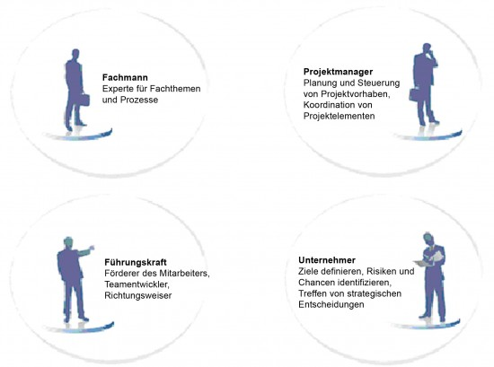

Der [Projektleiter](https://de.wikipedia.org/wiki/Projektleiter) ist für die operative Planung und Steuerung des Projektes verantwortlich. Um ein Projekt zu leiten und dieses erforlgreich zum Ziel zu führen benötigt ein Projektleiter neben fachlichen Kompetenz auch verschiedenste Fähigkeiten.   

# Welche Fähigkeiten benötigt ein Projektleiter?

Eine der wichtigsten Personen für den reibungslosen Projektablauf ist der Projektleiter. Ein Projektleiter hat die Aufgabe das Projekt zu initiieren und erfolgreich zum Abschluss zu bringen. Er definiert in der Vorbereitungsphase das Ziel, Budget und Termine und plant die einzelnen Projektschritte. Das Team, das für die Durchführung des Projekts bestimmt ist, koordiniert und motiviert er. Er legt Verantwortlichkeiten fest und verteilt die anfallenden Aufgaben. Dabei ist eine klare und eindeutige Kommunikation äußerst wichtig, damit alle Beteiligten die Aufgaben und Ziele verstehen und umsetzen können[^1]. 

Als Projektleiter muss man sowohl fundiertes fachliches Know-how, als auch die Kompetenzen einer Führungskraft, eines Projektmanagers und eines Unternehmers mitbringen. Im Idealfall füllt der Projektleiter vier Rollen aus.

*Die vier Rollen des Projektleiters*

Diese vier Rollen verlangen unterschiedliche Fähigkeiten und Eigenschaften von dem Projektleiter.

# Fähigkeiten des Projektleiters als Fachmann

Die meisten Projektleiter erfüllen die fachlichen Anforderungen. Sie sind in der Lage, technische und fachliche Details zu verstehen, zu bewerten oder auch selbst auszuarbeiten. Diese Feldkompetenz und Branchenkenntnis erleichtert einem Projektleiter die tägliche Arbeit, da er Zusammenhänge schneller durchdringt als ein Fachfremder[^2].

* [Fachkompetenz](https://de.wikipedia.org/wiki/Fachkompetenz)

# Fähigkeiten des Projektleiters als Projektmanager

Ein Projektleiter muss zudem die Instrumente zum Planen und Steuern von Projekten kennen: Er muss in der Lage sein, die Rahmenbedingungen zu stecken, in denen Abläufe durchgeführt werden und innerhalb derer die Projektmitarbeiter selbständig agieren können. Danach ist es seine Aufgabe, für die Durchführung des Projektes zu sorgen, es zu überwachen und das Team zu leiten. Diese Anforderungen fallen unter die Kategorie „Projektmanagement“ und beinhalten die Fähigkeit, das Projekt zu initiieren, zu definieren, zu planen, durchzuführen, zu steuern und zu bewerten[^1].

* Projektstrukturplan 
* Aufwand schätzen und Budgetverwaltung
* Zeitleistenplanung
* Beherrschen der Projektmanagement-Instrumente und deren Anwendung
* Organisationskompetenz
* Erfahrung in der Projektarbeit

# Fähigkeiten des Projektleiters als Führungskraft

Projektleiter sind Führungskräfte. Ein Projektleiter führt ein Projektteam. Er sollte in der Lage sein, die sich teils widersprechenden Interessen von Kunden, Vorgesetzten, involvierten Abteilungen und den eigenen Projektmitarbeitern zu managen. Der Umgang mit den verschiedenen Stakeholdern eines Projektes erfordert ein hohes Maß an sozialer Kompetenz. Zudem sind Soft Skills auch sehr wichtig für Projektmanagement[^2]

* [Sozialkompetenz](https://de.wikipedia.org/wiki/Soziale_Kompetenz), vor allem die Fähigkeit zur Führung der Projektgruppe: Fähigkeit zu delegieren, Vorbildfunktion, Zusammenarbeit, Motivierung des Projektteams
* Belastbarkeit, flexibilität und Anpassungsfähigkeit: 
bestmöglicher Umgang mit unvorhersehbaren Problemen und Notfällen, Zeitdruck
* Konfliktfähigkeit: 
frühzeitig Erkennung von Konflikt, Umgang mit Widerständen, konstruktive Verhaltensweisen in Konfliktsituationen, Verantwortungsgefühl 
* Kommunikationsfähigkeit: 
Koordinierungsaufgaben, Kontaktfreudigkeit, Überzeugungsfähigkeit, Durchsetzungsvermögen, Verhandlungshärte und -geschick

# Fähigkeiten des Projektleiters als Unternehmer

Auch wenn der Projektleiter kein Unternehmen leitet, ähnelt die Aufgabe der eines Geschäftsführers – im Kleinformat und für begrenzte Zeit: Es gilt, Budgets zu planen und mit ihnen zu wirtschaften, Risiken zu identifizieren und zu bewerten, Handlungsstrategien zu entwerfen. Auch Marketingaktivitäten gehören dazu, denn das Projekt muss nach außen gut verkauft und bekannt gemacht werden, damit es Erfolg hat und man, wenn nötig, Partner gewinnen kann. Erfahrene Projektleiter sind daher „Unternehmer im Unternehmen“[^1].

* Risikomanagement
* Überblick über das ganze Projekt

# Fähigkeiten des Projektleiters in Digitalisierungsumgebung

Entwicklungen bei digitalen Technologien verändern Verhalten, Produktivität und Leistung[^4]. Da Unternehmen Projekte zur Einführung von Technologie einsetzen, benötigen Projektleiter bestimmte digitale Fähigkeiten[^5]. Projektleiter automatisieren sich wiederholende Aufgaben und ermöglichen die Genauigkeit bei der Schätzung von Aufgaben mithilfe von Künstliche Intelligenz. Daher entwickeln sich  die Fähigkeiten, die von einem Projektleiter benötigt werden, weiter. 

* Datenwissenschaft: Datenmanagement Analytik mit große Datenmengen
* Sicherheit und Datenschutz Wissen
* Innovative Denkweise
* Fähigkeit zu machen datengesteuerte Entscheidungen

# Fähigkeiten des Projektleiters zu entwickeln

# Siehe auch

* Verlinkungen zu angrenzenden Themen
* [Projektmanagementhandbuch](https://www.projektmanagementhandbuch.de/)

# Weiterführende Literatur

* [Projektmanagementhandbuch](https://www.projektmanagementhandbuch.de/)

# Quellen

[^1]: [Was ist ein Projektleiter](https://refa.de/berufe/projektleiter)

[^2]: [Was Projektleiter können müssen](https://www.business-wissen.de/artikel/projektmanagement-was-projektleiter-koennen-muessen/)
)

[^3]: [Welche Eigenschaften braucht ein guter Projektleiter?](https://www.experteer.de/magazin/welche-eigenschaften-braucht-ein-guter-projektleiter/)

[^4]: Morris, PWG, 2013. Rekonstruktion des Projektmanagements erneut: eine Wissensperspektive. Projektmanagement-Journal, 44 (5), p. 6–23.

[^5]: PMI, 2018. DER PROJEKTMANAGER DER ZUKUNFT: Entwicklung von Projektmanagementfähigkeiten im digitalen Zeitalter, um in disruptiven Zeiten erfolgreich zu sein, sl: Projektmanagement-Institut.