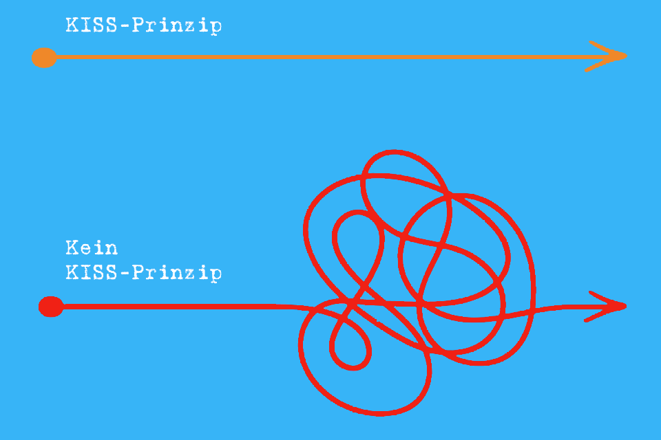
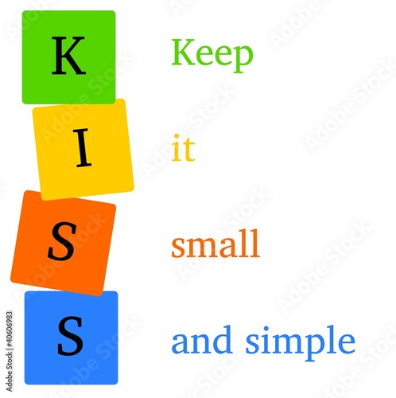

Die Luftfahrt- und Forschungsingenieurin Clarence Johnson (1910-1990) verwendete erstmals den Satz “Keep It Simple, Stupid”, aus Englisch "Halte es einfach, Dummkopf!". “Stupid” dem Satz eine flapsige, aber wohlmeinende Bedeutung gibt: "Zerbreche dir den Kopf nicht, wenn es auch einfach geht." Daraus entstand das KISS-Prinzip, welches heutzutage allerdings diverse Übersetzungen zur Grundlage haben kann.

Das KISS-Prinzip kann als eine Methode des Selbstmanagements verstanden werden. Viele Menschen erreichen ihre Ziele nicht, weil sie sich zu viel vornehmen. Stattdessen müssen sie diese daher mehr „smart and simple“ formulieren. Etwas „simple“ zu halten bedeutet unter anderem, Ziele zeitlich zu terminieren und den Weg zum Ziel einzuteilen – wiederum mit terminierten Zwischenzielen.

# [mehr Info zum KISS-Prinzip](https://startupwissen.biz/was-bedeutet-eigentlich-kiss/)

# Definition

Das KISS-Prinzip dient der Reduzierung von Komplexität. Hierbei gilt es als Leitsatz, um Kommunikation möglichst einfach zu gestalten, sodass es zu keinen Missverständnissen oder unnötig komplexen Bearbeitungszeiten kommt. Auch in einer Zeit von rasanten Veränderungen konzentriert man sich bei gleichzeitig hohen Leistungsanforderungen auf das Wesentliche. 

Albert Einstein hat gesagt: “Wenn du es nicht einfach erklären kannst, hast du es nicht gut genug verstanden.” Damit drückte er kurz und knapp das “keep it simple, stupid” (KISS) aus.
Minimalistisch also, verständlich und so, dass jeder damit zurechtkommt. Egal ob Studierter, ein unerfahrener Internet-Nutzer, jemand aus einer anderen Branche oder eine außenstehende Person, die gar keine Ahnung von dem Thema hat. Jeder kann es problemlos verstehen, wenn man es einfach haltet.

# Mögliche Übersetzungen

Die beiden Buchstaben S in KISS können verschieden interpretiert werden. Für das erste S kommen folgende Übersetzungen in Frage: Simpel, Small, Short oder Silly. Das zweite S könnte wie folgt übersetzt werden: Stupid, Smart, Simpel, Straightforward. Das Akronym KISS bildet selbst wieder ein Wort (englisch kiss, deutsch Kuss). 

## Mögliche Bedeutungen der Abkürzung

1. Keep it simple, stupid
2. Keep it short and simple 
4. Keep it simple and straightforward 
4. Keep it simple and smart
5. Keep it simple [and] stupid
   1. Keep it simply stupid

# Funktion

Außer Einfachheit und Verständnis ist auch der Erinnerungswert ein Bestandteil des Prinzips. Je umfangreicher etwas gestaltet ist, desto verworrener ist die Wahrnehmung damit. Besonders hohe Anwendung findet KISS im Marketing, der Kommunikation, der Werbung und dem Management. In der Produktentwicklung und Werbung ist es besonders wichtig, damit Vorgaben eingehalten werden und die Zielgruppe (oft von Kunden) bestens erreicht wird. KISS wird hierbei maßgeblich auf Botschaften und Gestaltung angewandt. Es wird aber auch in Bereiche wie das Webdesign, das Produktdesign und die Softwareentwicklung eingesetzt.

# Priorisierung nach Effektivität und Effizienz
Ziele sind immer zu priorisieren, wobei die Prioritäten nach Effizienz und Effektivität bei der Erreichung sortiert werden müssen. Das bedeutet: Wenn ein bestimmtes Ziel erreicht wird, erzeugt es einen großen Effekt. Doch steht die Frage, wie viel Aufwand die Erreichung kostet. Möglicherweise ist dieser Aufwand so hoch, dass die angestrebte Effektivität verpufft. Vielleicht lassen sich kleinere Ziele mit einem nicht so großen Effekt wesentlich effizienter erreichen und sollten daher eher priorisiert werden.

| Effizienz                | Effektivität                |
| -------------------------| --------------------------- |
| "Die Dinge richtig tun." | "Die richtigen Dinge tun."  |
| "Management"             | "Leadership"                |

# Einfachheit als Erfolgsgarant

Wenn ein Produkt nicht einfach und leicht verständlich ist, wird es schnell durch ein besseres ersetzt, das dem Nutzer eine höhere Usability bietet. Vor allem im Ingenieurwesen erlangt das KISS-Prinzip viel Aufmerksamkeit, da es eine gute Grundlage für viele Projekte darstellt. Auch für CEOs, Trainer und Ausbilder bietet KISS viele Vorteile.

# Halten Sie es einfach - aber nicht zu einfach

Die Einfachheit eines Produktes darf nicht dessen Nutzwert schmälern. Einige Produkte sind von Natur aus komplexer als andere. Komplexität sollte dann vermieden werden, wenn sie nur um ihrer selbst willen existiert und sie keine Verbesserung für den Benutzer darstellt.

# Siehe auch

* [https://www.projektmagazin.de/glossarterm/kiss-prinzip](Das KISS-Prinzip im Projektmanagement)
* [https://www.hklearning.ch/e-learning-meets-kiss/](E-Learning meets KISS)
* [https://www.youtube.com/watch?v=9q_nI2AkpKI&ab_channel=PhilippevonHogendorf](Das KISS-Prinzip - Was ist das? / Wie kannst du es für dich nutzen?)

# Quellen

1. Das KISS-Prinzip für Design nutzbar machen, www.twt.de,(https://www.twt.de/news/detail/management-summary-das-kiss-prinzip-fuer-design-nutzbar-machen.html)
2. Das KISS-Prinzip und wie es euch helfen kann, selbstaendig-im-netz.de, (https://www.selbstaendig-im-netz.de/usability/das-kiss-prinzip-und-wie-es-euch-helfen-kann/) 13. Februar 2017
3. DAS KISS-PRINZIP FACHBEGRIFFE EINFACH ERKLÄRT, www.arocom.de, (https://www.arocom.de/fachbegriffe/projektmanagement/kiss-prinzip)
4. Keep It Smart And Simple!, www.upgreat.de, (https://www.upgreat.de/keep-it-smart-and-simple-2943/), 27. SEPTEMBER 2019
5. KISS (-Prinzip), onma.de, (https://onma.de/online-marketing-lexikon/kiss-prinzip/)
6. Was ist das KISS-Prinzip?, t2informatik.de, (https://t2informatik.de/wissen-kompakt/kiss-prinzip/)
7. KISS-Prinzip, stock.adobe.com, (https://stock.adobe.com/de/images/kiss-prinzip/40606983?as_campaign=ftmigration2&as_channel=dpcft&as_campclass=brand&as_source=ft_web&as_camptype=acquisition&as_audience=users&as_content=closure_asset-detail-page)
