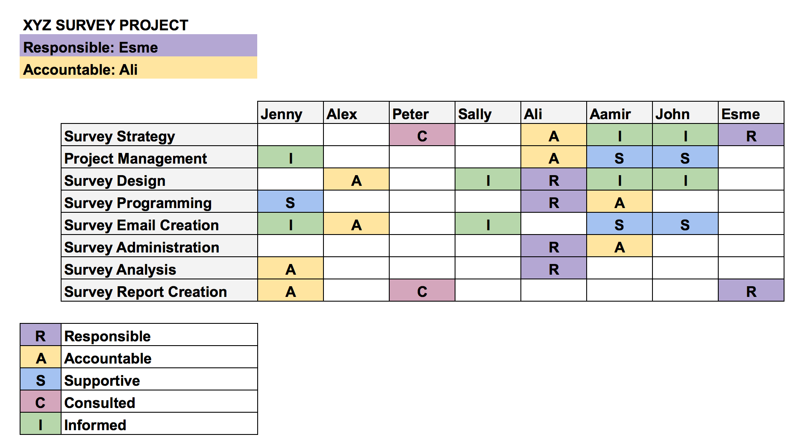

„Konfliktmanagement bezeichnet den Prozess der Konflikterkennung, -analyse, -lösung und der nachhaltigen Konfliktvermeidung.“[^1]  
Dabei stellt sich die Frage, was überhaupt ein Konflikt ist.
Das Wort „[…] Konflikt leitet sich ab vom lateinischen Substantiv „conflictus“, das so viel wie „Zusammenstoß“ bedeutet […]“[^2]
und beschreibt dementsprechend eine Situation, in der unterschiedliche Ansichten und Vorlieben aufeinandertreffen.[^3]

Konflikte können bereits sehr früh erkannt werden, da „der Ansatz von Konflikten […] 
schon in der [Projektstart-Phase](Projektphasen_klassisch.md) entstehen [kann]."[^4]
Auf einen fehlgeschlagenen [Projektstart](Projektstart.md) folgt meist ein Konflikt.[^5]  
Die frühzeitige Erkennung und Vermeidung von Konflikten spielt somit bei dem Konzept des klassischen Projektmanagement eine wichtige Rolle, 
da diese bei der Umfangreichen [Projektplanung](Projektplanung.md) berücksichtigt werden können.  
Zentrale Aufgaben der Projektleitung, im klassischen Projektmanagement, sind Uneinigkeiten mittels eindeutiger Ansagen und durchdachtem Vorgehen zu umgehen.[^6]

Um Konflikte bestmöglich zu lösen, hat man sich Gedanken gemacht welche verschiedenen Arten es von Konflikten gibt. 
Im Folgenden sind einige dieser Möglichkeiten aufgelistet:

| SACHLICHE KONFLIKTE  | PSYCHSOZIALE KONFLIKTE |
| ---------------------| ---------------------- |
| Zielkonflikt         | Wertekonflikt          |
| Beurteilungskonflikt | Beziehungskonflikt     |
| Verteilungskonflikt  |                        |
| Rollenkonflikt       |                        |
[^7]
 
Mit Hilfe dieser Untergliederung, kann man auf die einzelnen Konflikte mit bestimmten Lösungsansätzen besser und schneller reagieren.

# 1.Erkennen, analysieren und lösen eines Konflikts am Beispiel des Rollenkonflikts

Ein Rollenkonflikt im Allgemeinen ist eine Auseinandersetzung von zwei oder mehreren Personen eines Projektteams,
die sich uneinig über die Aufgabenverteilung sind.[^7]
Deswegen ist es wichtig im klassischen Projektmanagement 
„Rollen, also Status, Aufgaben und Verantwortungsbereiche der einzelnen Teammitglieder, bei Projektstart“[^8] klar voneinander abzugrenzen und zu verteilen.

## 1.1„Using RASIC Roles for Successful Collaborations“[^9]

Mithilfe der R.A.S.I.C Matrix kann im klassischen Projektmanagement vorab die Rollenverteilung veranschaulicht und verwaltet werden,
wobei die Abkürzung R.A.S.I.C für Responsible, Accountable, Support, Informed und Consultet steht.[^7]
Somit handelt es sich hier um die Rollen der Verantwortlichkeit, der Rechenschaftspflichtigkeit, der Unterstützung, der Information und der Konsultation.
Die R.A.S.I.C Matrix ist eine erweiterte Form der Standart-Matrix [RACI](RACI.md),
welche die Rolle der Verantwortlichkeit noch in die Rolle der Unterstützung unterteilt.[^10]

Im Folgenden ist eine solche RASIC [Matrix] (https://wirtschaftslexikon.gabler.de/definition/matrix-37186) vereinfach dargestellt:

 [^11]
*Rasic-Matrix*

Hier ist gut erkennbar, dass durch eine solche [Matrix](Matrix_Projektorganisation.md) vereinfacht dargestellt werden kann, 
welcher Mitarbeiter für welche Tätigkeit zuständig ist.

# 2. Fazit und Kritik am Konfliktmanagement in Bezug auf das klassische und agile Projektmanagement

Letztendich stellt sich die Frage, ob Konfliktmanagement im klassischen Projektmanagement sinnvoll ist.
Die Antwort ist, ja. 
Konflikte lassen sich durch einige Methoden wie beispielsweise die R.A.S.I.C. Matrix im klassischen Projektmanagement
schon bei der anfänglichen Planung des Endzustandes eines Projektes erkennen und vermeiden.[^12]

Jedoch ist dies selbstverständlich nicht zu verallgemeinern, 
da Menschen in beispielsweise Werte- und Beziehungskonflikten mit Emotionen Handeln und deshalb teilweise nicht abschätzbar ist,
wann ein solcher Konflikt entsteht.[^7]
In dieser Hinsicht bietet sich der Ansatz des agilen Projektmanagements an, 
da hier in „zeitlich begrenzten Zyklen (Sprints) [ge]arbeite[t] [wird], 
um flexibel auf Veränderungen zu reagieren“[^13] und besser auf spontan auftretende Konflikte eingegangen werden kann.

# Siehe auch

* [Projektstart-Phase](Projektphasen_klassisch.md)
* [Projektstart](Projektstart.md)
* [Projektplanung](Projektplanung.md)
* [RACI](RACI.md)
* [Matrix](Matrix_Projektorganisation.md)

# Weiterführende Literatur zum Thema Konfliktmanagement 

* https://www.youtube.com/watch?v=adoexrCtcjU

# Quellen

[^1]: [Holger Timinger, Wiley-Schnellkurs Projektmanagement (2015)]
[^2]: [Wytrzens Hans Karl, Projektleitung (2018)]
[^3]: [Vgl Wytrzens Hans Karl, Projektleitung (2018)]
[^4]: [Sabine Peipe, Crashkurs Projektmanagement; Grundlagen für alle Projektphasen (2020)]
[^5]: [Vgl. Sabine Peipe, Crashkurs Projektmanagement; Grundlagen für alle Projektphasen (2020)]
[^6]: [Vgl Raffael, Konfliktmanagement in Projekten (5.11.2013)](https://derwirtschaftsinformatiker.de/2013/11/05/projektmanagement/konfliktmanagement-in-projekten/)
[^7]: [Vgl. Anne Schüßler & Peter Schüßler, Weniger schlechte Projekte Managen; Ohne Krise zum Projekterfolg (4.9.2020)]
[^8]: [Anne Schüßler & Peter Schüßler, Weniger schlechte Projekte Managen; Ohne Krise zum Projekterfolg (4.9.2020)]
[^9]: [iDOGrants, How to Use a R.A.S.I.C Roles, Accountability and Responsibility Matrix (20.4.2018)](https://idogrants.org/2018/04/20/how-to-use-a-r-a-s-i-c-roles-accountability-and-responsibility-matrix/)
[^10]: [Responsibility assignment matrix (last edit: 11.10.21)](https://en.wikipedia.org/wiki/Responsibility_assignment_matrix)
[^11]: [Amber Bezahler, RASCI 101: How to move from chaos to order (2.4.2019)](https://medium.com/@abezahler/rasci-101-how-to-move-from-chaos-to-order-5b25db0869f4)
[^12]: [Nadine Ebel, Projektmanagement](https://www.materna.de/Microsite/Monitor/DE/2020-01/Management-und-Strategie/pm-methoden/pm-methoden)
[^13]: [Mahir Kulalic, Was ist agiles Projektmanagement? (19.09.2021)](https://www.factro.de/blog/agiles-projektmanagement/)
