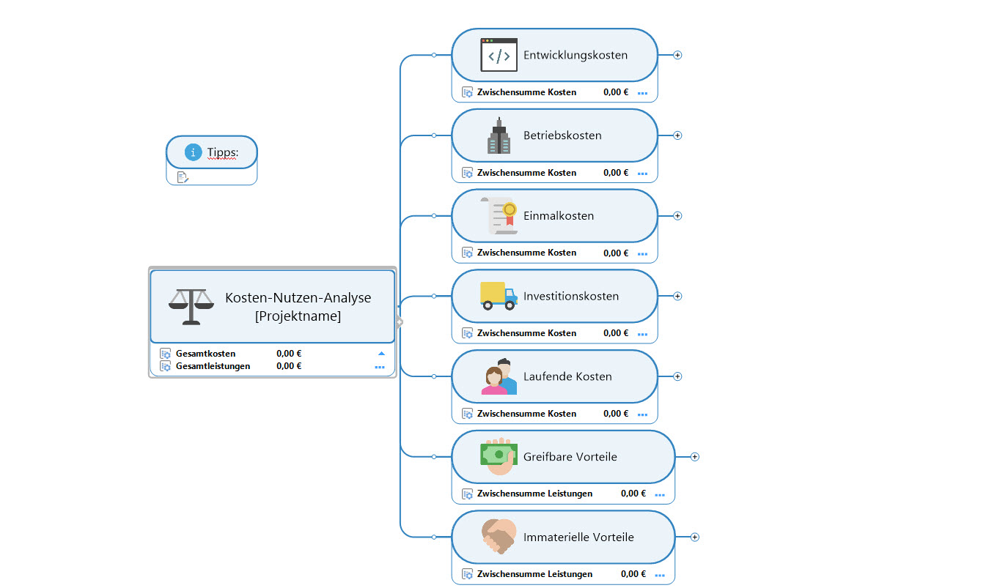

Die Kosten-Nutzen-Analyse ist ein Bewertungsverfahren, das die Wirtschaftlichkeit von [Projekten](Projekt.md) prüft und den monetär bewerteten Nutzen mit den Kosten einer Maßnahme vergleicht.
> „Zweck der Analyse ist die Auswahl der Alternative aus einer Menge von möglichen Alternativen, deren Realisierung ein Gesamtziel am effektivsten erfüllt.“(Hüftle, 2006)[^1]

# Kosten-Nutzen-Analyse
Im [Projektmanagement](Projektmangement.md) hat der [Projektleiter](Faehigkeiten_Projektleiter) die Aufgabe, Aufträge sinnvoll zu erteilen, sodass diese zum Projekterfolg beitragen. Hierbei kann eine Kosten-Nutzen-Analyse hilfreich sein.

Bewertungsverfahren sind in der Praxis häufig angewendete Methoden, um mögliche Handlungsalternativen in Bezug auf deren Mehrwert hierarchisch einzuordnen und die Vorteilhafteste dieser zu bestimmen.[^2] 
Neben der oben gennanten Kosten-Nutzen-Analyse gibt es noch weitere Bewertungsverfahren[^1]:
* [Nutzwertanalyse](Nutzwertanalyse.md)
* Kosten-Wirksamkeits-Analyse
* Wirkungsanalyse
* [Risikoanalyse](Risikoanalyse_und_Visualisierung.md)

## Definition

Die Kosten-Nutzen-Analyse ist eine Wirtschaftlichkeitsuntersuchung, d.h. sie bewertet den prognostizierten, monetären Aufwand aller anfallenden Kosten und entstehendem Nutzen. Dementsprechend wird versucht, dem Nutzen sowie den Kosten einen [Geldwert](https://de.wikipedia.org/wiki/Geldwert) beizumessen, um eine einfachere Vergleichbarkeit zwischen verschiedenen Alternativen zu ermöglichen.[^3]

Die Ergebnisse der Analyse tragen maßgeblich zu richtungsweisenden Entscheidungen bezüglich z.B. der [Projektplanung](Projektplanung.md) oder [-budgetierung](Kostenplanung.md) bei. 

## Rahmenbedingungen 
Im Vorfeld der Durchführung müssen gewisse Rahmenbedingungen bestimmt werden, sowie Voraussetzungen erfüllt sein, welche für einen reibungslosen Ablauf sorgen sollen. 

* Zuallererst wird die zu untersuchende Situation, also die Problem- und Aufgabenstellung, beschrieben. 
* Dem folgt die Benennung von Bewertungskriterien, anhand deren der Nutzen definiert wird. 
* Um der Analyse einen festen Rahmen zu geben, wird ein [Analyse-Umfeld](Umfeldanalyse.md) festgelegt.
* Als letztes werden die zu analysierenden Maßnahmen genannt und definiert.[^3]

Um die Analyse fundiert durchsetzen zu können, sind vorher noch einige wichtige Aspekte zu berücksichtigen.
| Checkliste[^4]  |
| ------------- |
| Ziel der Analyse ? | 
| Alleiniges Entscheidungskriterium ?  | 
| Ausmaß des Einflusses auf Entscheidung  |
| Wer führt die Analyse durch ? |
| Wurden genügend qualitative Merkmale ausgewählt ? |
| Woher kommen Informationen, Daten, Fakten ? |
| Wie können Merkmale bewertet werden ? |
| Angemessener Zeitraum angesetzt ? |

Innerhalb dieses Rahmens erfolgt die eigentliche Analyse. 

## Vorgang der Analyse 

Der detaillierte Ablauf der Analyse unterscheidet sich in manchen Quellen bezüglich Reihenfolge und Wortlaut. Im Grunde zielen jedoch alle auf dasselbe Ergebnis.

Nach Hüftle beinhaltet die Analyse 11 Schritte, wie im folgenden aufgelistet[^1]: 

1.	Aufstellen des Zielsystems: Struktur des Zielsystems muss standfest sein, damit daraus wichtige mess- bzw. schätzbare Indikatoren herausgelesen werden können
2.	Bestimmung von Indikatoren, mithilfe derer abgeleitet werden kann welche Wirkung die Ausführung einer Alternative hat.
3.	Analyse der Rahmenbedingungen, ob und welche die Entscheidung verzerren können
4.	Festlegung von Alternativen, sowie der [Nullalternative]( https://wiki.baw.de/de/index.php/Nullalternative)
5.	Definition von möglichen Auswirkungen der Alternativen auf die Ziele
6.	Monetäre Bewertung der möglichen Auswirkungen
7.	Anwendung einer [Sensitivitätsanalyse]( https://www.bwl-lexikon.de/wiki/sensitivitaetsanalyse/) 
8.	[Diskontierung]( https://www.compeon.de/glossar/diskontieren/#modal-1 ) aller Kosten und Nutzen auf einen gemeinsamen Stichtag
9.	Vergleich der Nutzen und Kosten und Berechnung der erforderlichen Kennzahlen 
10.	Gesonderte Bestimmung von nicht-monetär beschreibbaren Indikatoren
11.	Entscheidung: Nach Berücksichtigung der monetären Kennzahlen sowie nicht-monetären Auswirkungen, 
                  Auswahl der Alternative mit dem besten Kosten-Nutzen-Verhältnis
                  
*Mögliche Modellierung eines Diagramms einer Kosten-Nutzen-Analyse*

[^5]
## Kritik 
Eine Kosten-Nutzen-Analyse ist für eine [erfolgreiche Umsetzung von Projektzielen](Praxisbeispiele_erfolgreiche_Projekte.md) essentiell. Sie bringt viele Vorteile mit sich, weist jedoch auch einige Schwächen auf.
### Vorteile
* Verschiedene Alternativen sind direkt miteinander vergleichbar
* Einfache und übverschaubare Darstellung
* Grundlage für weitere Projektentscheidungen wird geschaffen[^6]

### Nachteile
* Die Ergebnisse dienen zwar als Entscheidungsgrundlage, allerdings werden bis dato Risiken und deren Eintrittswahrscheinlichkeiten nicht bzw. kaum beachtet. Als Lösung müsste zusätzlich eine [Risiko- und Sensitivitätsanalyse](Risikoanalyse_und_Visualisierung.md) durchgeführt werden[^7]
* Die Analyse ist manipulationsanfällig, da "Bewertungsmaßstäbe der Kosten und Nutzen, der Umfang der in das Kalkül einbezogenen externen Effekte, die Wahl der relevanten Zeitperiode und damit verbunden die Bestimmung des Diskontfaktors sowie die Berücksichtigung von Nebenwirkungen nicht „objektiv“ festgelegt werden können" (Minter, 2018)[^8]

# Siehe auch

* Verlinkungen zu angrenzenden Themen
* [Link auf diese Seite](Kosten_Nutzen_Analyse.md)

# Weiterführende Literatur

* Weiterfuehrende Literatur zum Thema z.B. Bücher, Webseiten, Blogs, Videos, Wissenschaftliche Literatur, ...

# Quellen

[^1]: Hüftle, M.(2006); Bewertungsverfahren, http://www.optiv.de/Methoden/BewVerfa/BewVerfa.pdf (aufgerufen am 12.11.2021)
[^2]: Benson, L.; Bewertungsmethoden, https://www.uni-trier.de/fileadmin/fb4/prof/VWL/SUR/Lehre/WS0203/uebung-sroe/folien/Folien_13-02-03.pdf (aufgerufen am 18.11.2021)
[^3]: Angermeier, G.(2005); Kosten-Nutzen-Analyse, https://www.projektmagazin.de/glossarterm/kosten-nutzen-analyse (aufgerufen 09.11.1021)
[^4]: Kosten-Nutzen-Analyse, https://www.lexoffice.de/lexikon/kosten-nutzen-analyse/ (aufgerufen am 15.11.2021)
[^5]: Wenzelis, N. (2021); Diagramme zur Kosten-Nutzen-Analyse: Was sie sind und wie man sie einsetzt, https://blog.mindmanager.com/de/blog/diagramme-zur-kosten-nutzen-analyse-was-sie-sind-und-wie-man-sie-einsetzt/ (aufgerufen am 16.11.2021)
[^6]: Kosten - Nutzen - Analyse, http://managementmethoden.info/TBProjektWerkzeuge/TBKoNuAnalyse (aufgerufen am 18.11.2021)
[^7]: Kosten-Nutzen-Analysen berücksichtigen Risiko nicht, http://www.solutionmatrix.de/kosten-nutzen-analyse.html (aufgerufen am 18.11.2021)
[^8]: Minter, S.(2018); Kosten-Nutzen-Analyse, https://wirtschaftslexikon.gabler.de/definition/kosten-nutzen-analyse-40767/version-264145 (aufgerufen am 18.11.2021)

