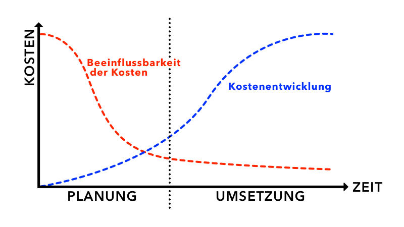

# Begriffsklärung
Der Begriff der Kostenplanung beschreibt im Kontext des Projektmanagements die möglichst akkurate Abschätzung der im gesamten Projektverlauf anfallenden Kosten und Aufwände [^1]. Ziel ist das Vermeiden von überraschend hohen (und auch niedrigen) Gesamtkosten für ein Projekt. Die Kostenplanung ist ein Bestandteil des Kostenmanagements und folgt innerhalb dessen auf die Kostenschätzung. Von dieser unterscheidet sie sich wesentlich durch die deutlich genauere Planung der einzelnen auftretenden Kosten für detaillierte Arbeitsschritte anstelle grober Schätzungen für gesamte Projektvorgänge. Außerdem werden die auftretenden Kosten in verschiedene Strukturen eingeteilt. Das Kostenmanagement wird nach der Planung durch die Kostenkontrolle abgeschlossen. [2]

# Zweck & Ziele der Kostenplanung
Es gibt mehrere Gründe, warum eine hochwertige Kostenplanung für den Erfolg eines Projekts von großer Bedeutung ist. Noch vor Projektstart kann durch frühe Planungen und Schätzungen Erkenntnis darüber gewonnen werden, ob das Projekt überhaupt rentabel bzw. sinnvoll ist. Des Weiteren bildet die Kostenplanung die Basis für die Angebotskalkulation, auf dessen Basis der Projektvertrag und damit die Konditionen für das Projekt festgeschrieben werden. Eine realistische Planung ist hierfür unersetzlich. Im Verlauf des Projekts dient die Kostenplanung darüber hinaus zu einem laufenden Soll-Ist-Vergleich der laufenden und vorhergesagten Kosten. So erfolgt die kontinuierliche Kontrolle des Projekterfolgs. Erkenntnisse aus diesem Vergleich dienen der Projektsteuerung. Die Relevanz von möglichst akkuraten Kostenplanungen ist für die Reputation einer Firma zentral. Zu niedrige Kalkulationen führen im Projektabschluss zu Streitigkeiten über Nachzahlungen mit dem Kunden während Planungen mit zu viel Reserve die Wahrscheinlichkeit senken, von Kunden Aufträge zu erhalten. Da die Beeinflussbarkeit der Kosten mit Projektfortschritt rapide abnimmt ist eine verlässliche Schätzung zu Beginn von größter Relevanz.

# Zerlegung des gesamten Projekts in Arbeitspakete
Um eine genaue Schätzung zu gewährleisten, wird das gesamte Projekt in mehrere, kleinere Arbeitspakte aufgeteilt [3]. Dafür wird vom gesamten Projekt ein Projektstrukturplan (VERWEIS!) gebildet, der die Übersicht über die Kostenstruktur erheblich vereinfacht. Die Kosten der einzelnen Arbeitsschritte werden nach oben im Plan akkumuliert und bilden am Ende die Gesamtkosten des Projekts

# Planungs- und Schätzverfahren
Zuerst erfolgt die sogenannte Einzelkostenplanung. Einzelkosten sind alle Kosten, die sich direkt einem Projekt/Produkt zurechnen lassen. Sie werden in drei Kategorien eingeteilt. Material,- Personal-, und Sondereinzelkosten. Je nach Typ wird geschätzt, wie viel von diesem Faktor verbraucht wird und welche Kosten eine Einheit erzeugt. Kumuliert ergibt dies die Summe der Einzelkosten für ein Projekt. Die Verbrauchsmengen können z.B. über Stücklisten, Vergangenheitswerte oder Konstruktionszeichnungen geplant werden. [4]
Im Anschluss steht die Gesamtkostenplanung. Hierbei werden die ermittelten Einzelkosten um die anfallenden Gemeinkosten ergänzt. Unter Gemeinkosten versteht man alle Kosten, die in einem Unternehmen anfallen, allerdings nicht einem konkreten Vorgang zugeordnet werden können. Man unterscheidet sie in Material-, Fertigungs-, Verwaltungs- und Vertriebsgemeinkosten. Diese werden über festgelegte Zuschlagssätze hinzugerechnet. [4]
Auch für schwierig zu schätzende Projektbestandteile sollte unbedingt eine Kostenplanung erstellt werden. Hierbei kann eine klare Kommunikation mit erfahrenen Fachexperten oft ein genaueres Bild über zu erwartende Aufwendungen geben. [3] Außerdem sollte bei der Planung stets etwas Spielraum für Unvorhergesehene Kosten einberechnet werden. [4]
Die gesamte Kostenplanung sollte sorgfältig auf Fehler überprüft werden. Leicht können kleine Ungenauigkeiten in Formeln, Umrechnungskosten oder Stundensätzen die Planung verfälschen. Darüber hinaus sollten getroffene Annahmen, auf denen die Planung basiert eindeutig benannt werden. [3]
