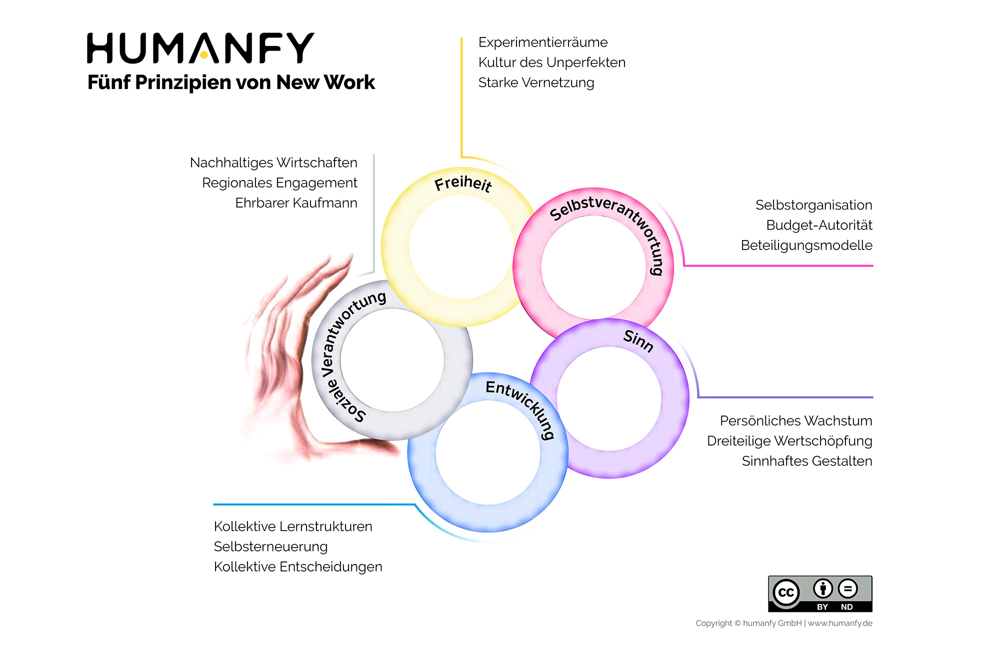

New Work ist ein philosophischer Denkansatz des Sozialphilosophen Frithjof Bergmann der Anfang der 1980er Jahre begründet wurde.[^1][^7] Er beschreibt eine neue Art der Arbeit unter der Annahme das alte Arbeitssystem sei überholt.[^2]

# Entstehungsgeschichte
New Work wurde Anfang der 1980 Jahre im Zuge der Automatisierung beim Automobilhersteller General Motors in Flint, Michigan von Frithjof Bergmann entwickelt. Bergmann stellte fest, dass nicht die ganze Arbeit abgeschafft, sondern diese nur verkürzt wird.[^1]
So erarbeitete er das Konzept "New Work". 
Es bestand daraus, dass die Angestellten sechs Monate in der Fabrik arbeiten und den Rest des Jahres, zusammen mit dem neu gegründeten "Zentrum für neue Arbeit", herausfinden was sie "wirklich, wirklich" wollen. Das Ziel war nicht Entlassungen zu verhindern, sondern Zeit zur professionalisierten Berufungsfindung zu geben.[^7][^6]

# Philosophie
## Grundannahmen

New Work stellt zwei Annahmen in den Vordergrund:
* Arbeit kann Leben nehmen sowie geben.
* Menschen erkennen keine Sinnhaftigkeit in ihrer Arbeit.[^1]

Daraus leitet Bergmann den Ausdruck "Armut der Begierde" ab.
Menschen leiden häufig darunter, dass ihre Begierde nachlässt und das Wollen durch die Erziehung unterdrückt wird.[^5]

Es geht beim New Work darum, diesen Mangel abzubauen und in den Arbeitenden eine Verbindung zwischen Sehnsucht, Leidenschaft, Erfüllung und Arbeit herzustellen.[^2]
Um Arbeit mit Begierde und positiven Eigenschaften zu verbinden postuliert Bergmann des Weiteren den Zentralen Ausdruck <b>"wirklich, wirklich wollen"</b>. 
Die bewusst gewählte Dopplung verdeutlicht, dass hiermit keine einmalige Überlegung gemeint ist, sondern, eine wiederkehrende Auseinandersetzung mit der eigenen Begierde.[^1]
Es soll die Beschäftigung gefunden werden, die das Leben erfüllt und nicht als ein milderes Übel angesehen wird. New Work versucht zwischen dem ""wirklich, wirklich wollen" und dem davon leben können eine Brücke zu schlagen.[^2][^5]

New Work übt auch schwere Kritik an der Lohnarbeit, da der Mensch nur arbeitet, um Wünsche eines anderen für Geld zu erfüllen. Die Lohnarbeit steht somit im Konflikt mit dem Grundgedanken der neuen Arbeit: die Arbeit zu machen, weil das Individuum sie wirklich, wirklich will.[^9]

# New Work heute

New Work hat durch die zunehmende Forderung nach selbstbestimmter und erfüllender Arbeit an Bedeutung, im Unternehmenskontext, gewonnen.[^6] So setzten Unternehmen auf eine Vielzahl an Methoden um sich "New Work auf die Fahne zu schreiben".[^9] Solche Methoden umfassen bspw. das Anbieten von Homeoffice, Tischtennisplatten und "recreation areas".[^9]
Bergmann bezeichnet dieses Verständnis jedoch als "Lohnarbeit im Minirock" und als einen, von der ursprünglichen Definition, abweichenden Modebegriff.[^6]

Im Gegensatz dazu gibt es Unternehmen die versuchen New Work zu verstehen und auf die Anforderungen der Wirtschaft anzupassen.

Ein Beispiel hierfür ist die humanfy GmbH.

Die von Humanfy definierte "New Work Charter" zeigt wie aus der ursprünglichen recht einfachen Doktrin des "wirklich, wirklich Wollens" ein umfassendes Mitarbeiterkonzept entstanden ist. Die Methodik beinhaltet die wichtigsten Punkte, um die ursprünglichen Anforderungen von New Work mit der heutigen Unternehmenskultur zu versöhnen.[^4]

*Die 5 Prinzipien von New Work (Ausgearbeitet von Humanfy)*[^3]

# New Work im Projektmanagement
In der "New Work Charta" wird verdeutlicht, dass das heutige Verständnis von New Work eher ein agiles ist. Der Mensch soll frei, selbstverantwortend, sinnhaft, sich weiterentwickelnd und mit sozialer Verantwortung arbeiten. 

Um den Mitarbeitenden eine erfüllende Beschäftigung zu bieten, orientieren sich auch viele Konzepte des Projektmanagements bewusst oder unbewusst an den Grundpfeilern der "New Work Charta" und erfüllen so Anforderungen an New Work. Eine Auswahl dieser Konzepte ist:

* <b> [Feedback Kultur](Feedback_Kultur.md)</b>
 
  Das Geben und Nehmen von Rückmeldungen wird in einer Feedback Kultur als Kernkompetenz verstanden und soll die Mitarbeiterentwicklung anregen. Die Feedback Kultur ist somit ein Beispiel für den Punkt "Entwicklung" der New Work Charta.[^1][^3]
* <b> [Vision](Projekt_Vision.md) </b>
  
  Die verinnerlichte und verbildlichte Zukunftsvorstellung, auf die sich das Unternehmen bezieht, ist was eine Vision ausmacht.[^1] Die Vision dient dem Unternehmen als Wegweiser und Bild der Zukunft welches die Mitarbeiter leiten und motivieren soll. Somit ist die Vision dem Unterpunkt "Sinn" der New Work Charta zuzuordnen.[^1][^3]
* <b> [Retrospektive](Retrospektive.md) </b>

  Um Arbeitsprozesse und Ergebnisse zu reflektieren werden, sogenannte, Retrospektiven veranstaltet. Das Ziel dieser Teammeetings besteht darin, Lerneffekte aus Arbeitsprozessen abzuleiten und als Team und Individuum dazuzulernen. Durch den kontinuierlichen Lerneffekt ist dieses Projektmanagementkonzept dem Punkt "Entwicklung" der New Work Charta zuzuschreiben.[^1][^3]

# Siehe auch

* Verlinkungen zu angrenzenden Themen
* [Link auf diese Seite](New_Work.md)

# Weiterführende Literatur

* [Blog - Markus Väth](https://markusvaeth.com/blog/)
* Schnell Nils, Schnell Anna , New Work Hacks, Springer Gabler, Wiesbaden 2019, ISBN 978-3-658-27298-2
* Brommer Dorothee et. al., Faszination New Work: 50 Impulse für die neue Arbeitswelt, Springer Gabler, Wiesbaden 2019 ISBN 978-3-658-24617-4
* Wörwag Sebastian, Cloots Alexandra, Arbeitskulturen im Wandel, Springer Gabler, Wiesbaden 2020, ISBN 978-3-658-30450-8
* Väth Markus, Beraterdämmerung, Springer Gabler, Wiesbaden 2019, ISBN 978-3-658-24102-5
* Bergmann Frithjof, Neue Arbeit, neue Kultur, Arbor Verlag 2020, EAN 9783867812849
* Bergmann Frithjof, Die Freiheit leben, Arbor Verlag 2005, ISBN 978-3-936855-03-6
* [Vortrag von Prof. Dr. Frithjof auf Xing New Work Experience 2017](https://www.youtube.com/watch?v=29IoGFD86QM)
* [Podcast mit Prof. Dr. Frithjof](https://open.spotify.com/episode/29PXaxK6U0I6BM5FCmlMgY?si=G5N6I79RQT6Bxp3hEEUQ0A)

# Quellen

[^1]: [New Work Hacks](https://link.springer.com/book/10.1007%2F978-3-658-27299-9)
[^2]: [Beraterdämmerung](https://link.springer.com/book/10.1007%2F978-3-658-24103-2)
[^3]: [HUMANFY New Work Charta](https://humanfy.de/new-work-charta/)
[^4]: [Markus Väth](https://de.wikipedia.org/wiki/Markus_V%C3%A4th)
[^5]: [XING New Work Experience, Vortrag Prof. Dr. Frithjof](https://www.youtube.com/watch?v=29IoGFD86QM)
[^6]: [Hornung S (2018) Interview zu New Work Frithjof Bergmann](https://www.haufe.de/personal/hr-management/frithjof-bergmann-uebt-kritik-an-akteuller-new-work-debatte_80_467516.html)
[^7]: [University of Michigan](https://news.umich.edu/eight-faculty-members-retire/)
[^8]: [New Work Definition](https://www.businessinsider.de/gruenderszene/lexikon/begriffe/new-work/)
[^9]: [On the Way to New Work Folge #100 mit Fritjhof Bergmann](https://open.spotify.com/episode/29PXaxK6U0I6BM5FCmlMgY?si=G5N6I79RQT6Bxp3hEEUQ0A)

