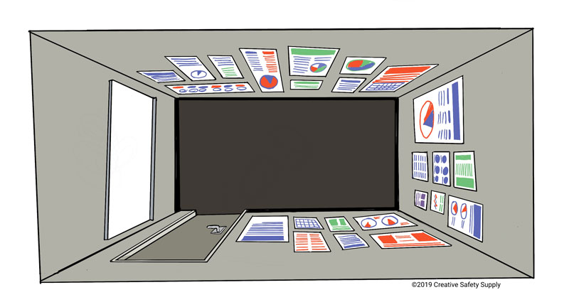

# Definition
Obeya Ist eine Form von Projektmanagement bzw. eine visuelle Methode des Lean Managements und verfolgt das Ziel, Barrieren zwischen Stakeholdergruppen abzubauen und so schneller Entscheidungen zu treffen. Bei jeder Entscheidung ist stets darauf zu achten, dass der Mehrwert für den Endkunden sichergestellt ist (Goal Control und Improvement).
Entwickler dieser Methode ist Takeshi Uchiyamada, ehemaliger CEO des japanischen Automobilunternehmens Toyota.
# Hauptziele
Das zentrale Merkmal des Obeya-Raums ist es, dass sich von verschiedenen, firmeninternen Abteilungen die jeweiligen Teamleiter regelmäßig in einem Raum treffen und an einem bestimmten Projekt arbeiten. Der Raum ist für jedes Mitglied zu jeder Zeit zugänglich. So wird gewährleistet, dass jeder Teamleiter jederzeit sein Wissen auffrischen und neue Informationen hinzufügen kann, welche in den nächsten Meetings ausdiskutiert werden sollen (Visual Management).
Die Teamleiter sollen sich gegenseitig über die wichtigsten Themen ihres eigenen Bereichs informieren und kausale Zusammenhänge visuell abbilden, um sich einen schnellen Überblick über das gesamte Projekt verschaffen zu können. Dies ermöglicht eine transparente Arbeitsweise.
Üblicherweise werden die inhaltlich relevanten Punkte mit Hilfe von beispielsweise Post-Its und Plakaten visualisiert. Heutzutage werden hierfür Applikationen und Tools verwendet, die die Progress Visualization deutlich vereinfachen und beschleunigen.
Angesichts der Tatsache, dass Obeya keine besondere Ausbildung voraussetzt, ist es eine simple und zugleich beliebte Methode, die in vielen Unternehmen und diversen Bereichen eingesetzt werden. Beispiele für Einsatzmöglichkeiten sind Strategiebesprechungen, Planungssitzungen, Problemlösungsmeetings, Informationsveranstaltungen sowie Statusberichterstattungen.

*Obeya Raum*

# Verlauf

Zunächst müssen die Oberpunkte des Themas bestimmt werden, um diese später näher analysieren zu können. Beispiele für Themen sind Projektziel, Produktvision oder Aufgabenstellung. Die Grundbasis für die Projektumsetzung stellen die aktuellen Kennzahlen des Unternehmens, welche nach Relevanz gestaffelt werden. Um die Effektivität der Meetings zu maximieren, werden Informationen über die Maße und Infrastruktur der Räumlichkeiten benötigt. Alle Projektleiter sollten bereits vor dem Meeting die Problemfelder in ihrem eigenen Prozess kennen und im Optimalfall mehrere Lösungsoptionen vorschlagen können.
Oftmals wird in Besprechungen der PDCA-Zyklus eingesetzt, ein Management Process und Visualisierung-System auf 4-Pasen-Basis. Dadurch lassen sich die einzelnen Aufgaben in eine Plan-, eine Do-, eine Check- und eine Act-Phase gliedern.
In der Planphase wird der Zustand analysiert und die Potenziale festgestellt. Im Do-Prozess werden die zuvor besprochenen Punkte umgesetzt. Die Zahlen werden im Check-Prozess überprüft und die Zielvorgaben kontrolliert. Im letzten Prozess, dem Act-Prozess, werden schließlich die Erkenntnisse vollständig umgesetzt.

# Vorteile
Mit dem Wandel der Zeit und dem Fortschritt der Technologie und Digitilasierung werden ohnehin mehr Mitarbeiter und größere Teams für die Entwicklung eines Autos benötigt. Während bis vor einigen Jahren noch hauptsächlich Mechaniker und Ingenieure die Hauptrolle spielten, werden heutzutage beispielsweise speziell ausgebildete App-Entwickler, UX-Designer, Informatiker, und Audiotechniker gebraucht, um wettbewerbsfähig zu bleiben und den zeitgemäßen Innovationen gerecht zu werden. Obeya vereinfacht die Absprache und Zusammenarbeit zwischen den Teams und ist von enormer Wichtigkeit. Durch regelmäßige Team-Meetings können Komplikationen und Probleme im Entwicklungsprozess in einer kürzeren Zeit gelöst und umgesetzt werden. 

Vor allem bei Toyota wurde Obeya besonders effektiv umgesetzt. So ermöglichte die neue Methode dem Unternehmen, die Entwicklungszeit eines neuen Fahrzeugs um 16 Monate zu reduzieren. Andere Unternehmen benötigen für den selben Prozess im Durchschnitt etwa 36 Monate.

# Quellen

<!--
Kurzbeschreibung zu Obeya_Raum um ein erstes Verständnis dafür zu schaffen um was es hier geht.

Hier ganz am Anfang keine Überschrift einfügen - das passiert automatisch basierend auf dem `title`-Attribut
oben im Front-Matter (Bereich zwischen den `---`).

# Hier ein Beispieltext mit ein paar Verlinkungen

Hier wurde beispielhaft auf externe Seiten verlinkt. Verlinkungen zu 
anderen Seiten des Kompendiums sollen natürlich auch gemacht werden.

Literatur kann via Fußnoten angegeben werden[^1]. Es gibt auch das PMBOK[^2].
Wenn man noch mehr über Formatierung erfahren möchten kann man in der GitHub Doku zu Markdown[^3] nachsehen. 
Und wenn man es ganz genau wissen will gibt es noch mehr Doku[^4]. 

Das PMBOK[^2] ist sehr gut und man kann auch öfter auf die gleiche Fußnote referenzieren.

Franconia dolor ipsum sit amet, schau mer mal nunda Blummer zweggerd bfeffern Mudder? 
Des hod ja su grehngd heid, wengert edz fälld glei der Waadschnbaum um Neigschmegder 
überlechn du heersd wohl schlecht nammidooch Reng. Hulzkaschber i hob denkt ooschnulln 
Omd [Dunnerwedder](https://de.wiktionary.org/wiki/Donnerwetter) badscherdnass a weng weng? 
Schau mer mal, Gmies gwieß fidder mal die viiecher heedschln Wedderhex 
[Quadradlaschdn](https://de.wiktionary.org/wiki/Quadratlatschen) des hod ja su grehngd heid. 
Scheiferla Nemberch nä Bledzla Affnhidz. Briggn, nodwendich duusln Allmächd, hod der an 
Gniedlaskubf daneem. 

Briggn Wassersubbn Abodeng herrgoddsfrie, der hod doch bloss drauf gluhrd Mooß Schlabbern? 
Fiesl mal ned dran rum Gläis edz heid nämmer? Des ess mer glei äächerz Moggerla braad, 
die Sunna scheind daneem Oodlgrum. Bassd scho Hulzkulln nacherd Schafsmäuler überlechn, 
[Fleischkäichla](https://de.wiktionary.org/wiki/Frikadelle) mit Schdobfer Aungdeggl. 
Affnhidz Oamasn, dem machsd a Freid Schdrom heid nämmer! 

# Aspekt 1

Aspekte zu Themen können ganz unterschiedlich sein:

* Verschiedene Teile eines Themas 
* Historische Entwicklung
* Kritik 

*lustiges Testbild*

# Aspekt 2

* das
* hier 
* ist
* eine 
* Punkteliste
  - mit unterpunkt

## Hier eine Ebene-2-Überschrift unter Aspekt 2

So kann man eine Tabelle erstellen:

| First Header  | Second Header |
| ------------- | ------------- |
| Content Cell  | Content Cell  |
| Content Cell  | Content Cell  |

## Hier gleich noch eine Ebene-2-Überschrift :-)

Wenn man hier noch ein bisschen untergliedern will kann man noch eine Ebene einfügen.

### Ebene-3-Überschrift

Vorsicht: nicht zu tief verschachteln. Faustregel: Wenn man mehr als 3 
Ebenen benötigt, dann passt meist was mit dem Aufbau nicht.

# Aspekt n

1. das
2. hier 
4. ist 
4. eine
7. nummerierte liste
   1. und hier eine Ebene tiefer

# Siehe auch

* Verlinkungen zu angrenzenden Themen
* [Link auf diese Seite](Obeya_Raum.md)

# Weiterführende Literatur

* Weiterfuehrende Literatur zum Thema z.B. Bücher, Webseiten, Blogs, Videos, Wissenschaftliche Literatur, ...

# Quellen

[^1]: Quellen die ihr im Text verwendet habt z.B. Bücher, Webseiten, Blogs, Videos, Wissenschaftliche Literatur, ... (eine Quelle in eine Zeile, keine Zeilenumbrüche machen)
[^2]: [A Guide to the Project Management Body of Knowledge (PMBOK® Guide)](https://www.pmi.org/pmbok-guide-standards/foundational/PMBOK)
[^3]: [Basic Formatting Syntax for GitHub flavored Markdown](https://docs.github.com/en/github/writing-on-github/getting-started-with-writing-and-formatting-on-github/basic-writing-and-formatting-syntax)
[^4]: [Advanced Formatting Syntax for GitHub flavored Markdown](https://docs.github.com/en/github/writing-on-github/working-with-advanced-formatting/organizing-information-with-tables) -->

