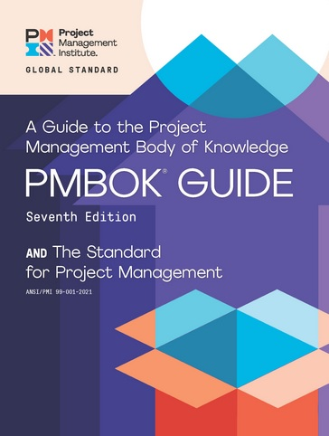

Der erstmals 1996 veröffentlichte PMBOK- Guide (A Guide to the Project Management Body of Knowledge) gilt als das zentrale Nachschlagwerk des [PMI](PMI_Institution.md) und ist ein anerkannter Standard des [Projektmanagements](Projektmanagement.md). Der PMBOK Guide gehört wie [PRINCE2](PRINCE2.md) zu den bekanntesten Ansätzen im [Projektmanagement](Projektmanagement.md).
Die vom PMI angebotene PMP [Zertifizierung](Zertifizierungen.md) baut u. a. auf dem Guide auf und gilt daher als wichtiges Referenzdokument [^1][^2].

# Aufbau des aktuellen PMBOK-Guides
Das Handbuch wird inhaltlich in den Standard und einen Leitfaden für das Projektmanagement gegliedert. Mit der 7. Edition wurden unter Berücksichtigung der technologischen und wirtschaftlichen Entwicklungen grundlegende Änderungen vorgenommen. Diese sollen aktuelle Herausforderungen im Projektmanagement besser widerspiegeln und Projektmanagern verbesserte Handlungsmöglichkeiten auf Marktveränderungen erlauben.
Anders als die Vorgänger basiert die neueste Ausgabe nicht mehr auf einer prozessorientierten Methodik, sondern auf Werten und Prinzipien. Zudem wurden die *Knowledge Areas* und die *Prozessgruppen* durch das sog. System für Wertlieferung, die Grundsätze und Projekt-Leistungsbereiche ersetzt [^3].

*PMBOK-Guide Seventh Edition* [^4]

| The Standard for Project Management | A Guide to the Project Management Body of Knowledge |
| ------------- | ------------- | 
| Introduction  | Project Performance Domains  |
| System for Value Delivery  | Tailoring |
| Projecet Management Principles | Models, Methods, Artifacts

_Die Themenbereiche der aktuellen Edition_ [^5]

# Inhalt des Standards

## System for Value Delivery

Verschiedene Elemente wie Portfolios, Programme und Produkte können, wenn sie in einem System kombiniert werden, dazu beitragen, je nach Organisationsstrategie einen bestimmten Wert zu schaffen. Damit die Übereinstimmung mit der Strategie und eine Anpassung an das interne und externe Umfeld gewährleistet sind, sollte zwischen den beteiligten Elementen ein regelmäßiger Informationsaustausch stattfinden. Das Governance System unterstützt dabei das System für Wertlieferung und stellt einen Rahmen für verschiedene Funktionen wie Aufsicht und Kontrolle dar. Diese können von einzelnen oder einer Gruppe von Personen durchgeführt werden. Dabei wird besonders die Dynamik der [Projektmitarbeiter](Projektmitarbeiter.md) betont, die unabhängig vom Führungsstil ist. Der PMBOK Guide schreibt den Anwendern zudem keinen speziellen Führungsansatz vor. Entscheidend für das Projektergebnis ist daher die regelmäßige Kooperation zwischen Projektmitgliedern und Stakeholdern [^6].

*Beispiel für das Wertlieferungssystem* [^6]

## Project Management Principles 
Die folgenden Grundsätze wurden von Projektspezialisten verschiedener kultureller und beruflicher Hintergründe erarbeitet. Sie ergänzen den *Code of Ethics and Professional Conduct* des [PMI](PMI_Institution.md) und sind nicht präskritpiv. Projektteams sollen sich lediglich an den Grundsätzen orientieren. Die Prinzipien sind konsistent und können sich untereinander oder mit anderen Managementprinzipien überschneiden [^7].

* Stewardship
* Team
* Stakeholders
* Value
* System Thinking
* Leadership
* Tailoring
* Quality
* Complexity
* Risk
* Adaptability and Resiliency
* Change

# Inhalt des Leitfadens

## Project Performance Domains

Alle Aktivitäten, die zusammenhängen und zum Erfolg eines Projekts beitragen, werden zu den acht Project Performance Domains gezählt. Aufgrund der gegenseitigen Abhängigkeit stellen sie ein integriertes System dar und sind durch einen simultanen Ablauf gekennzeichnet. Der Zusammenhang der Bereiche kann je nach Projekt Unterschiede aufweisen, ist jedoch immer vorhanden. Eine isolierte Betrachtung der Domains ist deshalb nicht vorgesehen. Abhängig von der Organisation, des Projektteams oder der Ziele setzen sich für die Bereiche, die nachfolgend aufgelistet sind, spezielle Aufgaben zusammen.

*	Stakeholder
*	Team
*	Development Approach and Life Cycle
*	Planning
*	Project Work
*	Delivery
*	Measurement 
*	Uncertainty [^8]

## Tailoring 

Aufgrund der individuellen Zusammensetzung jedes Projekts sind keine einheitlichen Ansätze möglich. Das Tailoring passt daher unter Berücksichtigung des Projektlebenszyklus, der erwünschten Ergebnisse und der beteiligten Mitarbeiter den Ansatz und die Prozesse an das jeweilige Projekt an. Die Project Management Principles, die Werte und Kultur des Unternehmens bilden dabei die Basis für den Tailoring- Vorgang [^9].

# Siehe auch

* [PMI](PMI_Institution.md)
* [PRINCE2](PRINCE2.md)
* [Projektmanagement](Projektmanagement.md)
* [Zertifizierung](Zertifizierungen.md)
* [Projektmitarbeiter](Projektmitarbeiter.md)

# Weiterführende Literatur

* Agile project management and the PMBOK® guide https://www.pmi.org/learning/library/agile-project-management-pmbok-waterfall-7042
* PMBOK Guide 7th Edition (12 Principles) https://www.youtube.com/watch?v=fGrsUSw1_Vw

# Quellen
[^1]:PMBOK Guide 7th Edition: Was PMP-Kandidaten wissen müssen https://www.theprojectgroup.com/blog/pmbok-guide-7th-edition/ Abgerufen am 23. November 2021.
[^2]:Kurz und knapp: Das ist neu beim PMBOK-Guide Edition 7 https://www.inloox.de/unternehmen/blog/artikel/kurz-und-knapp-das-ist-neu-beim-pmbok-guide-edition-7/ Abgerufen am 23. November 2021.
[^3]:PMBOK Guide 7. Ausgabe – Ein Überblick https://www.tiba-business-school.de/pmbok-guide-7-ausgabe-ueberblick/ Abgerufen am 23. November 2021.
[^4]:PMBOK® Guide https://www.pmi.org/pmbok-guide-standards/foundational/PMBOK Abgerufen am 23. November 2021.
[^5]:PMI (Hrsg.): A Guide to the Project Management Body of Knowledge: PMBOK guide, Seventh Edition, Newton Square 2021, ISBN: 978-1-62825-664-2, S.14
[^6]:PMI (Hrsg.): A Guide to the Project Management Body of Knowledge: PMBOK guide, Seventh Edition, Newton Square 2021, ISBN: 978-1-62825-664-2, S.34-47
[^7]:PMI (Hrsg.): A Guide to the Project Management Body of Knowledge: PMBOK guide, Seventh Edition, Newton Square 2021, ISBN: 978-1-62825-664-2, S.48-86
[^8]:PMI (Hrsg.): A Guide to the Project Management Body of Knowledge: PMBOK guide, Seventh Edition, Newton Square 2021, ISBN: 978-1-62825-664-2, S.102
[^9]:PMI (Hrsg.): A Guide to the Project Management Body of Knowledge: PMBOK guide, Seventh Edition, Newton Square 2021, ISBN: 978-1-62825-664-2, S.226-232

