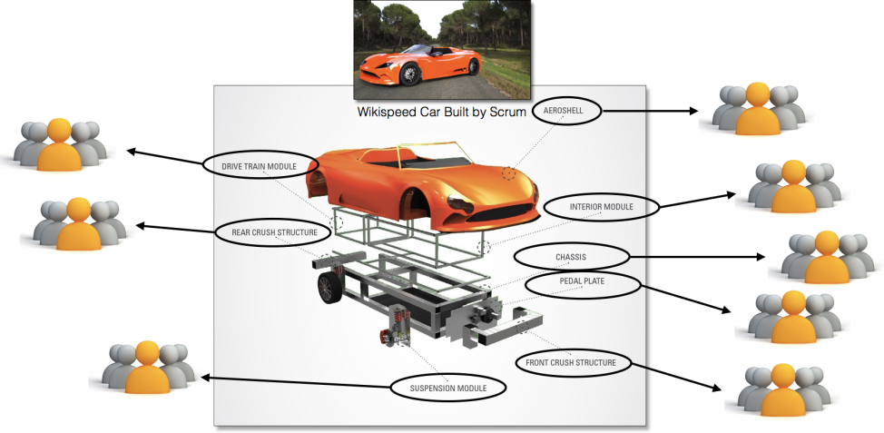

# Das Unternehmen Tesla 

Tesla ist ein US-Amerikanischer Konzern, der sich auf die Entwicklung und Fertigung von Elektroautos spezialisiert hat. 
Neben dem Autombilgeschäft, vertreibt Tesla weitere Produkte, die den Übergang zu einer CO2 neutralen Mobilität und Energiegewinnung ermöglichen[^1]. 
Gründer und CEO von Tesla ist der innovative und teils auch polarisierende Unternehmer [Elon Musk](https://de.wikipedia.org/wiki/Elon_Musk) [^2]

[^1]

| Tesla Inc.|[^1] |
| ------------- | -------------          | 
| **Gründung**      | 1. Juli 2003           |
| **CEO**           | Elon Musk              |
| **Hauptsitz**     | Palo Alto, Kalifornien |

# Agiles Projektmanagement bei Tesla 

Anders als bestehende Automobilkonzerne arbeitet Tesla bevorzugt mit agilen Projektmanagement-Methoden, ähnlich wie ein [Software-Unternehmen](Spotify_Projectmanagement_Model.md). Anstatt über einen langen Zeitraum Verbesserungspotentiale zu identifizieren, zu erforschen und letztendlich in einem Face-Lift Modell zu veröffentlichen, hat Tesla ein andere Philosophie [^3]. 
Tesla verbessert kontinuierlich seine Produkte, sowohl softwareseitig als auch die Technik und Hardware der Fahrzeuge wird laufend überarbeitet. So werden in kürzeren Intervallen die Produkte geringfügig verbessert. Bei anderen Autoherstellern werden bisher im zwei bis drei Jahre Rhythmus Face-Lifts mit marginalen Verbesserungen und alle vier bis fünf Jahre neue Modelle mit größeren Veränderungen herausgebracht. Während diesen Zeitperioden erfolgte keine weiteren Verbesserungen. 
Durch den agilen Ansatz bietet Tesla seinen Kunden zum Beispiel neue Softwarefeatures, so bald wie möglich, über over-the-air Updates an und verbessert diese bei Bedarf im Laufe der Zeit. Auch bei technischen Verbesserungen an seinen Fahrzeugen wartet Tesla u.U. nicht bis zur Veröffentlichung eines neuen Modells. Stattdessen werden kleinere Änderungen ohne großen Ankündigungen implementiert. So zum Beispiel aktuell neue Batterien mit mehr Reichweite im Tesla Model 3[^4]. Softwareverbesserungen hingegen kommen selbstverständlich allen Beteiligten zugute. 

## Scrum in der Fertigung von Autos / Produktion

Tesla ist eines der ersten Unternehmen, welches die agile Projektmanagementmethode [Scrum](SCRUM.md) für die Fertigung seiner Autos einsetzt [^3]. 
Grundsätzlich wird Scrum bei der Entwicklung von Software eingesetzt, das produzierende Gewerbe hingegen bedient sich meist klassischer Projektmanagement-Methoden, wie zum Beispiel dem [Wasserfallmodell](https://de.wikipedia.org/wiki/Wasserfallmodell) [^5]. Grundsatz der agilen Methoden ist die Annahme, dass das Endprodukt einige Änderungen verglichen zum ursprünglich Geplanten aufweist [^5]. Im Softwarebereich ist dies oft weniger problematisch als bei der Produktion von tangiblen Gütern. Dennoch weist die agile Methode auch dort einige Vorteile auf. So kann das Unternehmen noch während der Produktion auf Kundenwünsche oder Marktbedürfnisse eingehen und ermöglicht sich so einen potentiellen Wettbewerbsvorteil [^5]. 
Auf Tesla übertragen bedeutet dies, das Tesla flexibel auf Änderungen reagieren kann. Die [Gigafactorys](https://www.tesla.com/de_de/giga-berlin) des Unternehmens sind so aufgestellt, dass Änderungen im laufenden  Produktionsprozess, durch Re-Programmierung einzelner Teilbereiche, durchgeführt werden können. Wenn das Scrum-Team, welches für den Bau und die Entwicklung der Türen zuständig ist, beispielsweise leichtere, sicherere und günstigere Türen entwickelt hat, können diese unproblematisch in den bestehenden Fertigungsprozess eingebunden werden [^3].  

[^3]

*Beispielhafter Aufbau einer Scrum-Implementierung im Fahrzeugbau. 
    Zu sehen sind die einzelnen Scrum-Teams, eingeteilt in die verschiedenen Bauteile eines Fahrzeugs[^3].*
 

      

## Nachteile agiler Methoden in der Automobilbranche 

Ein Nachteil dieses Arbeitsansatzes besteht darin, dass das Produkt im Beta-Zustand an die Kunden ausgeliefert wird. So hat Tesla noch immer Probleme mit Spaltmaßen, Softwarebugs oder lauten Abrollgeräuschen [^3]. Ein weiterer Punkt, der bei Kunden für Verärgerung sorgen könnte, sind die ungekündigten, kleinen inkrementellen Verbesserungen an den Fahrzeugen. Zum einen freuen sich Neukunden über z.B. eine gestiegene Reichweite, zum anderen könnten Bestandskunden, die ihr Fahrzeug erst vor einigen Wochen bzw. Monaten erworben haben, verärgert über unerwartete technische Verbesserungen sein. 

# Quellen

[^1]: [Wikipedia; *Tesla Inc.*](https://de.wikipedia.org/wiki/Tesla,_Inc.)
[^2]: [FAZ; *Elon Musk*](https://www.faz.net/aktuell/wirtschaft/thema/elon-musk)
[^3]: [Field K.; *Tesla Has Applied Agile Software Development To Automotive Manufacturing*; 2018; CleanTechnica](https://cleantechnica.com/2018/09/01/tesla-has-applied-agile-software-development-to-automotive-manufacturing/)
[^4]: [Hebermehl G.; *Umbenennung Teil der Modellpflege*; 2021; auto-motor-sport](https://www.auto-motor-und-sport.de/elektroauto/tesla-model-3-mit-neuer-batterie-umbenennung-modellpflege/)
[^5]: [Abrudan, C. I., Baru, P. E., & Lungu, R. (2019). *Applying Scrum Methodology into the Production Processes of a Logistic Equipment Producer*; International Journal of Current Science Research and Review](https://ijcsrr.org/wp-content/uploads/2020/01/1-7.pdf)

