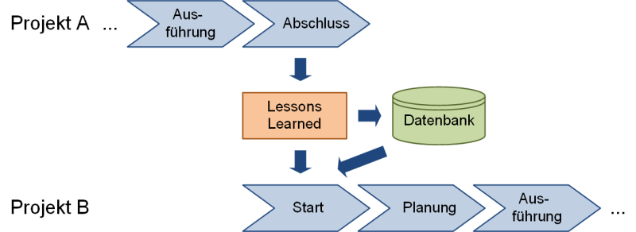

# Was ist ein Projektabschlussbericht?

Der Projektabschlussbericht (PAB) ist der letzte Prozess im Projektfortschritt und wird im Rahmen des Projektabschlusses durchgeführt, welcher bereits im Vorfeld des 
Kompendiums erläutert wurde. Der Projektabschluss stellt den letzten Abschnitt der Unternehmung dar und enthält zusätzlich Schritte wie die Produktabnahme oder die
Projektauflösung. Diese werden angrenzend an den Bericht final durchgeführt.[^1]. 

# Inhalt

Der Projektabschlussbericht gibt Aufschluss über:
* die **stattgefundenen Ereignisse** und die daraus **resultierenden Ergebnisse**
* **Erfolge** als auch **Misserfolge**

Diese Schlüsselerkenntnisse werden anhand verschiedener Aspekte und [Methoden](Methoden.md) beleuchtet, was letzten Endes Aufschluss über die Qualität und Zielgenauigkeit des Projektes gibt.
Ziel dieses 
Vorgehens ist es, die einzelnen Handlungsschritte zu reflektieren und die passenden Schlüsse daraus zu ziehen. Dies kann sowohl positiv, als auch negativ ausfallen. 
Dafür wird sich immer die Frage gestellt: *Was ist gut gelaufen und womit waren unsere Kunden zufrieden, aber auch wo besteht dringend Handlungsbedarf?*.   
  Er beschreibt also das **Gesamtergebnis**, sowie die **Entwicklung eines Projektes** und trägt besonders dazu bei, **Erfahrungen für künftige Vorhaben** zu sichern. 
Zusätzlich analysiert das Team die Stärken und Schwächen in der Projektarbeit und sollte auch am Ende der Fertigstellung noch einmal zusammenkommen[^2].

# Komponenten eines vollwertigen PAB`s

Bei der Erstellung eines Projektabschlussberichtes wird Bezug auf die unterschiedlichsten Abteilungen in einem Unternehmen genommen, was suggeriert 
wie umfassend ein solcher Bericht aufgebaut wird.
  Gerade deswegen führt dies nicht selten zu einem ablehnenden Verhalten seitens der Projektleiter, da es aus deren Sicht als unnötig und
zu zeitintensiv betrachtet und dennoch vom Auftraggeber gefordert wird. In einigen Fällen wird ein solches Dokumentieren geradezu als verpflichtend angesehen, wenn nicht 
sogar als unumgängliche Voraussetzung, um das Projekt offiziell zu beenden[^3].

## Hard Facts und Soft Facts

Die Kriterien, anhand dessen der Abschlussbericht gemessen wird, kann in zwei Bereiche gegliedert werden[^2]. Im Folgenden sind einige Beispiele aufgeführt:

### Hard Facts

* Kosten

Der monätere Rahmen stellt einen der wichtigsten Bestandteile dar, welcher im direkten Bezug zum Controlling steht. Dabei wird sowohl der Fokus auf die *Ist-/ 
und Soll- Kosten* gelegt und die daraus *resultierenden
Abweichungen*, als auch auf die *Nachkalkulation*, was die Ergebnisse der Schlussabrechnung widerspiegelt. Bei der Kalkulation ist zu berücksichtigen, dass dort alle 
angefallenen Aufwendungen in Bezug auf das Projekt eingehen, wie beispielsweise das Personal oder auch Materialkosten[^4].

* Zeitmanagement

Auch der Faktor Zeit spielt eine wichtige Rolle und sollte stets im Auge behalten werden, da dies wiederum direkten Einfluss auf die Kosten hat, welche sich mit 
Verlängerung der Zeit schnell über den geplanten Betrag hinausentwickeln können. Des Weiteren kann die Nichteinhaltung der Termine beim Auftraggeber zur Unzufriedenheit
führen.

### Soft Facts[^2]

* Zusammenarbeit

Auch die Soft Facts sollten nicht außer Acht gelassen werden, welche besonders in Bezug auf das Arbeitsklima zur Sprache kommen. Dies impliziert nicht nur die
Teamarbeit, sondern auch die Kooperartion mit relevanten Stakeholdern und Mitglieder anderer Projekte. Diese Abstimmung kann zum Beispiel anhand von Fragebögen
durchgeführt werden.

* Workshop

Da jedoch das Team in gewisser Weise die Basis eines erfolgreichen Ablaufes darstellt, sollte am Ende ein Abschlussworkshop durchgeführt werden, in welchem Erfahrungen 
besprochen werden und Erkenntnisse für zukünftige Projekte gewonnen werden. 

# Übersicht

  
  
  
  
*Es können Ressourcen in Form von Know-How aus dem vorherigen Projekt gezogen werden*   

  Es lässt sich demnach sagen, dass der Projektabschlussbericht durchaus einen großen Aufwand an Bürokratie darstellt. Dennoch können daraus viele brauchbare
Erkenntnisse in Form von *lessons learned* gezogen werden, welche man auf das nächste Projekt projizieren und Vorgehensweisen optimieren kann. 

# Siehe auch

* [Link zum Projektabschluss](Projektabschluss.md)
* [Link zu Lessons Learned](Lessons_Learned.md)  

# Quellen

[^1]: https://de.wikipedia.org/wiki/Projektabschluss
[^2]: https://www.projektmagazin.de/artikel/projektabschlussbericht-aussagekraeftig-und-schnell-erstellt_733
[^3]: https://www.business-wissen.de/hb/projektergebnisse-und-projekterkenntnisse-festhalten/
[^4]: https://projekte-leicht-gemacht.de/blog/methoden/projektabschluss/projektabschluss-checkliste/#Aktivitaeten-waehrend-des-Projektsbschlusses

