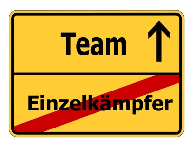

# Projektkultur:

Die Projektkultur umfasst alle Regeln, Werte und Normen eines Projektteams, die für dessen Verhalten, Umgang und Form der Kommunikation gelten. Projektkultur wird häufig im Team durch die Teamkultur erlebbar gemacht. Durch geltende Werte und Normen ist für alle Mitglieder transparent sichtbar, welche Handlungen als gut und wünschenswert und welche als negativ angesehen werden.
Eine Projektkultur sollte durch die Projektleitung gefördert werden. Es bietet sich an, am Anfang eines Projekts, eine Projektauftaktsveranstaltung, vielleicht auch über 2 Tage, zu machen. Bei dieser können sich sowohl alle Teammitglieder erstmal kennenlernen und ein Wir-Gefühl entwickeln, sowie erste Grundsätze und Werte für das gemeinsame Arbeiten geschaffen werden[^1].

Im Folgenden wird auf Kultur im Allgemeinen sowie den wichtigen Aspekt der Spielregeln bei der Zusammenarbeit im Team eingegangen

# Spielregeln bei der Zusammenarbeit

Die Spielregeln sind wohl der wichtigste Punkt der Projektkultur.
Damit sind allgemeine Grundsätze für die Zusammenarbeit in einem Projekt gemeint.
Häufig werden diese Regeln für ein spezifisches Projekt im Rahmen einer Projektstartveranstaltung gemeinsam erarbeitet und festgehalten. Diese sollten von allen akzeptiert und eingehalten werden.
Auch die Projektleitung trägt hier eine wichtige Rolle. Sie sollte während der Dauer des Projekts dafür sorgen, dass sich alle an die Regeln halten und das Team gegebenenfalls an ihre eigenen entwickelten Grundsätze erinnern[^1].

Diese Regeln können sehr individuell von Team zu Team sein. 
## Beispiele für Spielregeln könnten sein:
* Man lässt jeden ausreden
* Alle arbeiten aktiv im Team mit und trägt zum Projekt bei
* Alle sind pünktlich zu Terminen 
* Wir respektieren einander 
* Probleme werden offen und ehrlich kommuniziert
* Niemand handelt im Alleingang
* … [^1]

# Kultur im Allgemeinen 
Eine Kultur ergibt sich aus dem Zusammenspiel von Werten, Normen, Denkhaltungen und Paradigmen, welche z.B. die Bewohner eines Landes teilen. Dies kann man auch auf eine  niedrigere Ebene übertragen, z.B. ein Unternehmen oder ein Projektteam in einem Unternehmen. Jedes Unternehmen pflegt eine eigene Kultur. 
Wichtig ist jedoch zu beachten, dass eine Projektkultur sich in den Grundprinzipien auch mit der Unternehmenskultur übereinstimmt[^2].

Es gibt viele verschiedene Modelle und Erklärungsansätze zu Organisationskultur. Diese lassen sichh auch sehr gut auf Projektkulturen übertragen.
Im Folgenden wird auf die Kulturebenen von Edgar Schein eingegangen. 
Dieser beschreibt drei Ebene in seinem Modell[^2]. 

* Ebene 1: Sichtbare Verhaltensweise, Artefakte, Erzeugnisse, Rituale, Mythen, etc.
* Ebene 2: Gefühle für das Richtige, kollektive Werte
* Ebene 3: Grundannahmen, Wesen, Beziehungen zur Natur & anderen, Zeit-& Aktivitätsorientierung[^2]

Ebene 1 liegt an der Oberfläche, sie ist auch für Außenstehende sichtbar, sei es z.B. der Projektname, ein Slogan oder bestimmte Team-Rituale (morgendliche Meetings, wöchentliche gemeinsame Freizeitaktivitäten)[^2].

Unter dieser Ebene liegen die Gefühlsebene sowie kollektive Werte. Auch die Einstellung der Mitarbeiter und ihr daraus resultierendes Verhalten lässt sich aus der zweiten Ebene ableiten. Diese können z.B. im Rahmen der Spieregeln gemeinsam festgehalten werden[^2].

Die letzte und tiefste Ebene umfasst Dinge, die als selbstverständlich angenommen werden. Diese Grundannahmen werden nicht in Frage gestellt[^2].

# Siehe auch

* [Projektleiter](Projektleiter.md)
* [Projektkommunikation](Projektkommunikation.md)
* [Projekt Kick-Off](Projekt_Kick_Off.md)
* [Projekt](Projekt.md)

# Weiterführende Literatur

* [Folge 26 - Multi-Projektmanagement und Projektkultur (Teil 1)](https://www.youtube.com/watch?v=locN1oyoxkg)
* [Folge 26 - Multi-Projektmanagement und Projektkultur (Teil 2)](https://www.youtube.com/watch?v=BkmZQb2u5os)

# Quellen

[^1][Projektkultur und Projektspielregeln](http://projektnachwuchs.de/projektkultur-und-projektspielregeln/)
[^2][Organisationskultur](https://de.wikipedia.org/wiki/Organisationskultur)
