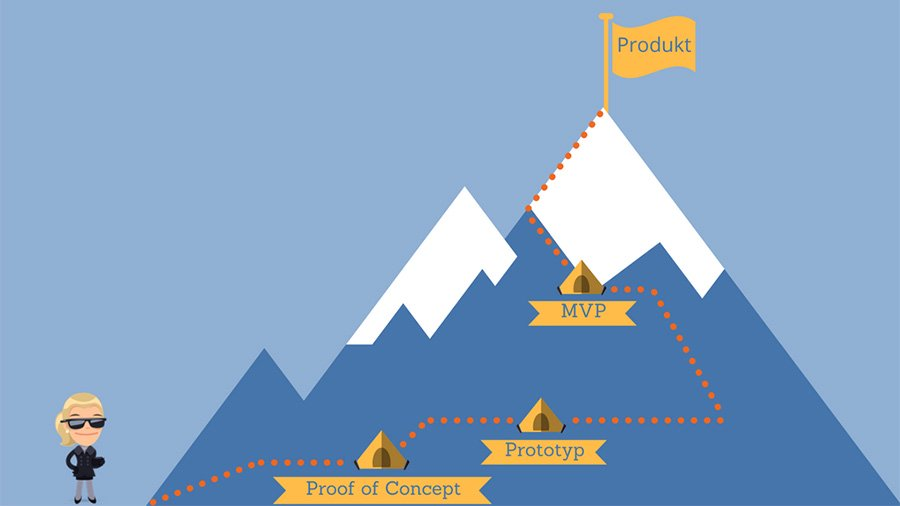

Kurzbeschreibung zu Proof_of_Concept um ein erstes Verständnis dafür zu schaffen um was es hier geht.

Der englische Begriff Proof of Concept (kurz POC) bezeichnet die Evaluation eines kleinen Ausschnittes eines Großprojekts und die Anfertigung einer Machbarkeitsstudie. Proof of Concept bedeutet übersetzt so viel wie Prüfung des Konzeptes [^3], wobei sich die Kriterien auf technische oder betriebswirtschaftliche Faktoren beziehen können.

# Was ist der Proof of Concept?

Proof of Concept bezeichnet das Prüfen eines Konzeptes bzw. eines Projektes auf dessen Machbarkeit. Dabei wird anhand von Faktoren wie Investitionsrisiken, Anforderungen an technische Applikationen oder Software, Funktions- und Akzeptanztests von Produkten oder Dienstleistungen validiert ob das Umsetzungsprojekt durchgeführt werden soll. Er dient also als Entscheidungsbasis für den weiteren Projektverlauf.  
Der Proof of Concept ist mit einer der ersten Meilensteine im Projektmanagement und legt den Grundstein für ein erfolgreiches Projekt.

*Einordnung des Proof of Concept* [^4]

# Der Aufbau und die Funktionsweise eines Proof of Conceptes

Es gibt unterschiedliche Strategien einen Proof of Concept für das Umsetzungsprojekt zu nutzen. Dazu gehört die direkte Umsetzung einer Idee, das Testen in Form eines Kleinprojekts oder eine Nutzenabschätzung bei Forschungszwecken.

Direkte Umsetzung ohne Proof of Concept
Bei dieser Variante handelt es sich um die Riskanteste, da direkt in das Umsetzungsprojekt gestartet wird. Einserseits bietet der Verzicht auf einen Proof of Concept einen Zeitvorteil, anderseits fallen Hürden und Probleme erst im Laufe des Projekts auf, wenn ein Abbruch sehr kostspielig ist. 

Testen der Idee eines kleinen Projektes mithilfe des Proof of Conceptes
Hierbei handelt es sich um die klassiche Form des Proof of Concepts. Mit einem kleinen Projektteam wird die Idee verprobt um anschließend eine Entscheidung zur Durchfhrung treffen zu können. Da im voraus an das Umsetzungsprojekt schon viele Erkenntnisse gewonnen wurden ist diese Variante mit deutlich weniger Rsikio behaftet.

So ist das Projekt erfolgreich und ein Nachweis den möglichen Investoren reicht in der Regel als Proof of Concept aus. Der einzige Nachteil dieser Idee ist, dass die Idee eine höhere Aufmerksamkeit erlangt und so etwaige Konkurrenten auf die Idee aufmerksam werden könnten.

# Proof of Concept in der IT [^3]

Ein klasschischer Anwendungsbereich eines Proof of Concepts sind IT-Projekte. Bei komplexen Implementierungsprojekten wird die zu implementierende Software zunächst rudimentär und mich technischen Durchstichen in die bestehenede Systemlandschaft integriert. Diese Integration zeigt Abhängigkeiten und Schwierigkeiten zu den Umsystemen auf die Umsetzungsprojekt geachtet werden muss. In einem Entwicklungsprozess für neue Anwendungssoftware oder für IT-Sicherheitslösungen wird dieser Projektschritt sehr häufig integriert und legt den Grundstein für die folgenden Projektabschnitte. Das Projektteam erhält durch den Proof of Concept eine konkrete Arbeitsbasis, auf die in der Folge aufgesetzt werden kann. In der IT-Sicherheit dienen solche Konzepttests auch dazu, Sicherheitslücken in Betriebssystemen oder Anwendungssoftware nachzuweisen.

# Proof of Concept in der Betriebswirtschaft [^3]

Nicht nur in der Softwareentwicklung ist der Proof of Concept weit verbreitet, auch Geschäftsideen, Unternehmensgründungen und die Entwicklung von Neuprodukten können einem Proof of Concept unterworfen werden. Hierbei wird, neben der generellen Machbarkeit, auch getetset inwieweit die Idee, das geplante Geschäftsmodell oder neue Produkte und Dienstleistungen aus betriebswirtschaftlicher Sicht funktionieren. In der Praxis ist ein umfangreicher und aussagefähiger Proof of Concept eine entscheidenede Voraussetzung dafür, Investoren für das eigene Projekte zu gewinnen.[^3]

Kern des betriebswirtschaftlichen Proof of Concepts ist die wirtschaftlichen Chancen der Neuentwicklung mit Blick auf die reale Marktentwicklung zu testen. Eine Kosten-Nutzen-Analyse ist dabei oftmals eine sehr hilfreiche Methodik, da sie betriebswirtschaftliche Kalkulationen ebenso, wie Markt- und Wettbewerbsbeobachtungen einschließt. Darüber hinaus ist der Erwerb umfassenden Wissens über potentielle Kunden entscheidend. Soweit es die neue Idee zulässt sollten reale Kunden beziehungsweise spätere Nutzer frühstmöglich in den Produktentwicklungsprozess eingebunden werden.

Anders als bei einem Proof of Concept im IT-Bereich werden betriebswirtschaftliche Proofs of Concepts idealerweise nicht als einmaliger Akt oder durch das Erreichen eines Meilensteins definiert, sondern als ein andauernder fortlaufender Prozess begriffen. Das eigene Geschäfts- oder Produktmodell wird während des Entwicklungprozesses stetig mit der Markt- und Gewinnreife und der Realitäten des Marktes und den Bedürfnissen potentieller Kunden abgeglichen. Durch diese Form lassen sich Kosten und Risiken des Markteintritts dutlich reduzieren.

# Siehe auch

* Verlinkungen zu angrenzenden Themen
* [Proof-Of-Technologie](Proof_of_Technologie.md)

# Weiterführende Literatur

* Weiterfuehrende Literatur zum Thema z.B. Bücher, Webseiten, Blogs, Videos, Wissenschaftliche Literatur, ...

# Quellen

[^1]: [https://www.it-business.de/was-ist-ein-proof-of-concept-a-666615/](https://www.it-business.de/was-ist-ein-proof-of-concept-a-666615/)
[^2]: [https://de.wikipedia.org/wiki/Proof_of_Concept](https://de.wikipedia.org/wiki/Proof_of_Concept)
[^3]: [https://www.businessinsider.de/gruenderszene/lexikon/begriffe/proof-of-concept/](https://www.businessinsider.de/gruenderszene/lexikon/begriffe/proof-of-concept/)
[^4]: [https://smartbusinessplan.de/businessplan-lexikon/proof-of-concept/]

______

[^3]: [Basic Formatting Syntax for GitHub flavored Markdown](https://docs.github.com/en/github/writing-on-github/getting-started-with-writing-and-formatting-on-github/basic-writing-and-formatting-syntax)
[^4]: [Advanced Formatting Syntax for GitHub flavored Markdown](https://docs.github.com/en/github/writing-on-github/working-with-advanced-formatting/organizing-information-with-tables)

