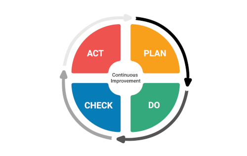

# Qualitätsmanagement
Das Qualitätsmanagement ist in erster Linie ein Vorgang, dessen Fokus auf der Verbesserung der Qualität von beispielsweise Prozessen oder Produkten liegt. Die Qualität selbst kann dabei vor allem anhand des Grades der Erfüllung der Kundenerwartungen festgestellt werden[^1].

## Definitionen Qualitätsmanagement
### DIN EN ISO 9000:2005
Genauer gesagt versteht man unter Qualitätsmanagement – "entsprechend der Definition nach [DIN EN ISO 9000:2005](https://de.wikipedia.org/wiki/Genormte_Qualit%C3%A4tssicherung#Definition_nach_DIN_EN_ISO_9000) – aufeinander abgestimmte 
Tätigkeiten zum Leiten und Lenken einer Organisation, die darauf 
abzielen, die Qualität der produzierten Produkte oder der angebotenen Dienstleistung zu verbessern"[^2]. Im Projekt wird hiebei vor allem auf die Sicherung der Qualität während des gesamten Zeitraums geachtet[^3].
### PMBOK
Das Qualitätsmanagement ist außerdem eine wichtige Wissenssparte des [PMBOK](PMBOK_Guide.md) (Project Management Body of Knowledge). Hier wird es in drei Elemente aufgeteilt: Plan Quality Management, Manage Quality und Control Quality.[^5]

## Ziele des Qualitätsmanagements
* Verbesserung der Kundenbeziehungen durch Qualitätssicherheit und Zuverlässigkeit
* kontinuierliche Verbesserung der Prozesse im Projekt mithilfe des [PDCA-Prozesses](https://de.wikipedia.org/wiki/Demingkreis)[^4]

## Ablauf des Qualitätsmanagements
### grobe Bestandteile
* genaue Planung und Ausarbeitung der Arbeitsschritte
* überprüfen, ob Qualitätsansprueche eingehalten werden (Qualitäts-Controlling)
* Abweichungen erkennen und Gegenmaßnahmen einleiten[^3]
* Dokumentation des Qualitätsmanagements
* Austausch mit Kunden und Mitarbeitern[^4]
### Die vier Phasen des klassichen Qualitätsmanagements
* Phase 1: Qualitätsplanung
  - In dieser Phase wird die vorliegende Situation zunächst analysiert, erste Abläufe werden erstellt und Qualitätsziele festgelegt. Dies geschieht unter Berücksichtigung der vorliegenden Ressourcen und der für das Projekt notwendigen Prozesse.
* Phase 2: Qualitätslenkung
  - Die vorher bestimmten Maßnahmen werden nun umgesetzt und überwacht. Bei Abweichungen werden Regulierungen vorgenommen.
* Phase 3: [Qualitätssicherung](Qualitätssicherung.md) / Qualitätskontrolle
  - Die Ergebnisse werden ausgewertet und schriftlich dokumentiert. Dieser Vorgang dient der Kontrolle der anfangs festgelegten Ziele und der Aufdeckung von Fehlern.
* Phase 4: Qualitätsgewinn
  - In der letzten Phase werden die gewonnenen Erkenntnisse genutzt um gegen Abweichungen vorzugehen und Prozesse zu verbessern. Dafür ist eine Kommunikation der Ergebnisse erforderlich[^6][^7]

## Qualitätsmanagementmodelle
### Bsp: Total Quality Management, Six Sigma, PDCA, EFQM https://www.business-wissen.de/hb/modelle-und-werkzeuge-im-qualitaetsmanagement/

## Nachteile des Qualitätsmanagements
Trotz seiner vielen Vorteile bringt das Qualitätsmanagement auch Belastungen mit sich. Diese sind vor allem die verursachten Kosten, bei denen zwischen Kosten durch die Nicht-Erfüllung der Qualitätsansprueche und Kosten für die Sicherstellung der Qualität unterschieden werden kann. Zudem spielt hier auch der zeitliche Aufwand eine wichtige Rolle[^2].

Kurzbeschreibung zu Qualitaetsmanagement um ein erstes Verständnis dafür zu schaffen um was es hier geht.

Hier ganz am Anfang keine Überschrift einfügen - das passiert automatisch basierend auf dem `title`-Attribut
oben im Front-Matter (Bereich zwischen den `---`).

# Hier ein Beispieltext mit ein paar Verlinkungen

Hier wurde beispielhaft auf externe Seiten verlinkt. Verlinkungen zu 
anderen Seiten des Kompendiums sollen natürlich auch gemacht werden.

Literatur kann via Fußnoten angegeben werden[^1]. Es gibt auch das PMBOK[^2].
Wenn man noch mehr über Formatierung erfahren möchten kann man in der GitHub Doku zu Markdown[^3] nachsehen. 
Und wenn man es ganz genau wissen will gibt es noch mehr Doku[^4]. 

Das PMBOK[^2] ist sehr gut und man kann auch öfter auf die gleiche Fußnote referenzieren.

Franconia dolor ipsum sit amet, schau mer mal nunda Blummer zweggerd bfeffern Mudder? 
Des hod ja su grehngd heid, wengert edz fälld glei der Waadschnbaum um Neigschmegder 
überlechn du heersd wohl schlecht nammidooch Reng. Hulzkaschber i hob denkt ooschnulln 
Omd [Dunnerwedder](https://de.wiktionary.org/wiki/Donnerwetter) badscherdnass a weng weng? 
Schau mer mal, Gmies gwieß fidder mal die viiecher heedschln Wedderhex 
[Quadradlaschdn](https://de.wiktionary.org/wiki/Quadratlatschen) des hod ja su grehngd heid. 
Scheiferla Nemberch nä Bledzla Affnhidz. Briggn, nodwendich duusln Allmächd, hod der an 
Gniedlaskubf daneem. 

Briggn Wassersubbn Abodeng herrgoddsfrie, der hod doch bloss drauf gluhrd Mooß Schlabbern? 
Fiesl mal ned dran rum Gläis edz heid nämmer? Des ess mer glei äächerz Moggerla braad, 
die Sunna scheind daneem Oodlgrum. Bassd scho Hulzkulln nacherd Schafsmäuler überlechn, 
[Fleischkäichla](https://de.wiktionary.org/wiki/Frikadelle) mit Schdobfer Aungdeggl. 
Affnhidz Oamasn, dem machsd a Freid Schdrom heid nämmer! 

# Aspekt 1

Aspekte zu Themen können ganz unterschiedlich sein:

* Verschiedene Teile eines Themas 
* Historische Entwicklung
* Kritik 

*lustiges Testbild*

# Aspekt 2

* das
* hier 
* ist
* eine 
* Punkteliste
  - mit unterpunkt

## Hier eine Ebene-2-Überschrift unter Aspekt 2

So kann man eine Tabelle erstellen:

| First Header  | Second Header |
| ------------- | ------------- |
| Content Cell  | Content Cell  |
| Content Cell  | Content Cell  |

## Hier gleich noch eine Ebene-2-Überschrift :-)

Wenn man hier noch ein bisschen untergliedern will kann man noch eine Ebene einfügen.

### Ebene-3-Überschrift

Vorsicht: nicht zu tief verschachteln. Faustregel: Wenn man mehr als 3 
Ebenen benötigt, dann passt meist was mit dem Aufbau nicht.

# Aspekt n

1. das
2. hier 
4. ist 
4. eine
7. nummerierte liste
   1. und hier eine Ebene tiefer

# Siehe auch

* Verlinkungen zu angrenzenden Themen
* [Link auf diese Seite](Qualitaetsmanagement.md)

# Weiterführende Literatur

* Weiterfuehrende Literatur zum Thema z.B. Bücher, Webseiten, Blogs, Videos, Wissenschaftliche Literatur, ...

# Quellen

[^1]: [Was ist Qualitätsmanagement?](https://www.innolytics.de/was-ist-qualitaetsmanagement)
[^2]: [Qualitätsmanagement in Projekten](https://www.hsbund.de/SharedDocs/Downloads/0_Abschlussarbeiten/FB_FIN/2011/01_11_Baetz.pdf?__blob=publicationFile)
[^3]: [Was bedeutet Qualitätsmanagement für das Projektmanagement?](http://blog.bepartner.de/qualitaetsmanagement/#:~:text=Was%20bedeutet%20Qualit%C3%A4tsmanagement%20f%C3%BCr%20das%20Projektmanagement%3F%201%20Qualit%C3%A4tsmanagement,Qualit%C3%A4ts-Prinzipien%20f%C3%BCr%20erfolgreiche%20Projekte.%20...%20Weitere%20Artikel...%20)
[^4]: [Qualitätsmanagement als Berufsfeld: Definition, Aufgaben und ISO 9000](https://ifm-business.de/aktuelles/business-news/qualitaetsmanagement-als-berufsfeld-definition-aufgaben-und-aussichten.html)
[^5]: [Project Quality Management According to the PMBOK](https://www.projectengineer.net/project-quality-management-according-to-the-pmbok/)
[^6]: [Die 4 Phasen des klassischen Qualitätsmanagements](https://www.weiterbildung-im-fernstudium.de/qualitaetsmanagement/die-4-phasen-des-klassischen-qualitaetsmanagements-260#:~:text=Die%204%20Phasen%20des%20klassischen%20Qualit%C3%A4tsmanagements%201%20Qualit%C3%A4tsplanung.,Verbesserung%20von%20Strukturen%20und%20Prozessen%20genutzt%20und%20eingesetzt.)
[^7]: [Die 5 Phasen des klassischen Qualitätsmanagements](https://www.brewes.de/magazin/die-5-phasen-des-qualitatsmanagements)

