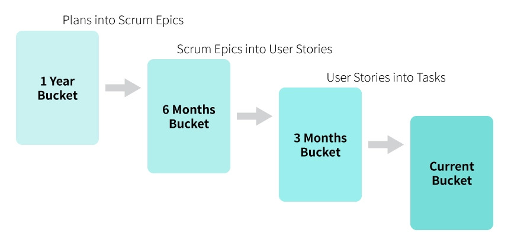

Scrumban ist ein aus [Scrum](SCRUM.md) und [Kanban](Kanban.md) gebildetes Kunstwort und beschreibt einen Methodenmix der beiden agilen Frameworks im Bereich des [Projektmanagements](Projektmanagement.md)[^1]. Dafür werden verschiedene Aspekte beider Methoden angewandt, auf die ich hier anschließend näher eingehen werde.

# 1. Historie
Der Scrum Begiff wurde bereits in den 1990er Jahrewn von Jeff Sutherland und Ken Schwaber geprägt, wohingegen Kanban sich erst zehn Jahre später in der Softwareentwicklung etablierte. Man erkannte jedoch realtiv schnell dass Scrum von den Visualisierungstechniken aus Kanban stark profitieren kann.
Scrumban wurde entwickelt um das beste aus beiden agilen Frameworks zu kombinieren und Scrum-Teams neue Möglichkeiten zu eröffnen und Kanban Konzepte in ihre Arbeit mit einzubinden[^2]. Der Schwerpunkt liegt darin Scrum durch einige Ideen aus dem Kanban Framework vor allem flexibler und reaktiver zu gestalten[^3].

# 2. Methodik
Die Idee von Scrumban lässt den dem Anwender eine gewisse Freiheit in der Frage welche Methoden und Konzepte man aus beiden agilen Frameworks für sein Team verwenden möchte. Flexibler als Scrum, welches klare Aufgaben und Rollen für bestimmte Personen im Team festlegt, während bei Kanban jeder im Team seine ursprüngliche Arbeit einfach weiter macht. Im Folgenden werden die wichtigesten Ansätze aus den beiden Frameworks welche welche für Scrumban essentiell sind näher dargestellt.

## 2.1 Methoden aus Scrum
### 2.1.1 Meetings 
Die Meetingstruktur verhält sich sehr ähnlich zu der von Scrum. Empfohlen sind sogenannte Dailys, also kurze 15-minütige Treffen im Team, um sich über den aktuellen Bearbeitungsstand auszutauschen und möglichen Probleme oder Verzögerungen im Arbeitsablauf zu notieren[^4].
### 2.1.2 Sprints
Die Arbeit wird in einzelne Sprints aufgeteilt. Ein Sprint ist ein Arbeitsabschnitt, in dem ein Inkrement einer Produktfunktionalität implementiert wird[^4]. Die Länge eines Sprints wird jedoch nicht auf ein bis vier Wochen begrenzt, wie es bei Scrum der Fall ist, sodass die Erfüllungsphase so lange andauern kann, wie es für das gewünchte Endergebnis erforderlich ist[^1].
### 2.1.3 Langzeitorientierte Planung
Scrumban implementiert langfristige Planungsmöglichkeiten durch das sogenannte "bucket-size-planning". Auf der folgenden Abbildung ist dieses Prinzip näher dargestellt. 

Man unterscheidet zwischen vier verschiedenen "buckets" mit jeweils unterschiedlichen Zielen und Inhalten:
* der 1 Year Bucket enthält grob definierte Ziele, welche ein Team innerhalb eines Jahres erreichen möchte.
* der 6 Months Bucket definiert Ziele die kurz vor der Umsetzung stehen.
* der 3 Months Bucket ist für Pläne die fast fertig sind vorbehalten.
* der Current Bucket beinhaltet alle Aufgaben die das Team als nächstes bearbeiten wird. [^3]
## 2.2 Methoden aus Kanban
### 2.2.1 Scrumbanboard
Das Scrumbanboard ist ähnlich zu einem [Kanban Board](Kanban_Boards.md), jedoch mit deutlich mehr Spalten. In der folgenden Abbildung ist ein Beispiel eines Scrumban Boards zu sehen

Man erkennt auf der linken Seite die To Do's die in vorherigen Sprints noch nicht bearbeitet wurden, sowie Aufgaben die im aktuellen Sprint noch zu erledigen sind. Mittig sind die aktuellen Aufgaben zu finden, welche derzeit bearbeitet werden und welche im nächsten Sprint zu erledigen sind. Auf der rechten Seite des Boards sind die Pläne zu finden die noch genehmigt werden müssen sowie alles was im aktuellen Sprint schon erledigt worden ist.[^5]
### 2.2.2 WIP-Limits

### 2.2.3 Pull-Prinzip
# 3. Fazit
So kann man eine Tabelle erstellen:

| First Header  | Second Header |
| ------------- | ------------- |
| Content Cell  | Content Cell  |
| Content Cell  | Content Cell  |

1. das
2. hier 
4. ist 
4. eine
7. nummerierte liste
   1. und hier eine Ebene tiefer

# Siehe auch

* [Scrum](Scrum.md)
* [Kanban](Kanban.md)
* [Projektmanagement](Projektmanagement.md)
* [Daily Scrum](Daily_Scrum.md)

# Weiterführende Literatur

* Weiterfuehrende Literatur zum Thema z.B. Bücher, Webseiten, Blogs, Videos, Wissenschaftliche Literatur, ...
* [Scrumban-essays on kanban systems for lean software development](https://books.google.de/books?hl=de&lr=&id=SQFdAgAAQBAJ&oi=fnd&pg=PA7&dq=wip+limits+scrumban&ots=ca61YFYzSf&sig=lvA3ZpYKeCpF959zZPPAFbsO3vI&redir_esc=y#v=onepage&q=wip%20limits%20scrumban&f=false)

# Quellen

[^1]: [Kanban Guide](https://kanbantool.com/de/kanban-guide)
[^2]: https://en.wikipedia.org/wiki/Scrumban#Tooling
[^3]: https://teamhood.com/de/agile-ressourcen/was-ist-scrumban/
[^4]: https://de.wikipedia.org/wiki/Scrum#Sprint
[^5]: [Das beste aus Scrum und Kanban](https://www.agile-heroes.de/magazine/scrumban-das-beste-aus-scrum-und-kanban-einfach-erklaert/)
