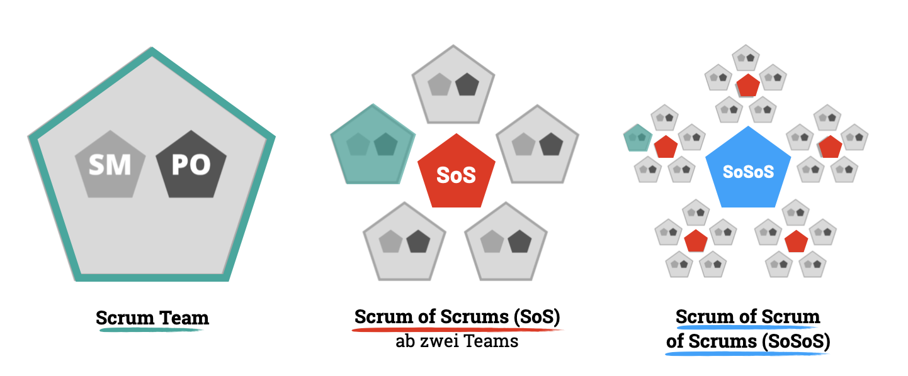
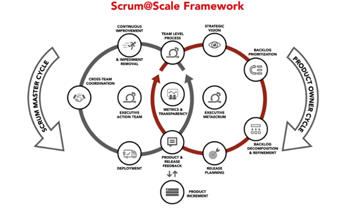

Was ist Scrum at Scale?

Scrum at Scale, oft auch Scrum@Scale mit dem ‘@’ Zeichen zusammengefasst bzw. Scrum at Scale Framework, ist ein agiler Ansatz, um das parallele Vorgehen von nach Scrum agierenden Entwicklungsteams zu koordinieren. Im Scope sind dabei nicht nur Entwicklungsabteilungen, sondern alle Bereiche die arbeitsteilig Produkte hervorbringen.

Scrum at Scale hebt agiles Arbeiten von Einzelprojekt auf Programm- bzw. Organisationsebene. Nicht zwangsläufig muss das Ergebnis dabei ein Softwareprodukte sein. Der 21-seitige Scrum@Scale Guide versteht unter ‘Produkt’ jede Form von System, also gleichsam Prozesse, Services und Hardware.

Dabei schreibt sich das Framework folgende Eigenschaften ganz oben auf die Fahne:

    Leichtgewichtig – minimale überlebensfähige Bürokratie
    Einfach verständlich – ausschließlich Scrum Teams
    Schwierig zu meistern – Umsetzung eines neuen Betriebsmodells erforderlich

# Konzept

Scrum@Scale setzt über alle Organisationsebenen konsequent auf Scrum. Dabei ist das Framework durch folgenden einfachen Aufbau gekennzeichnet, mit einem Scrum of Scrums als zentralen Baustein. Damit kann man Scrum theoretisch beliebig über die folgenden Ebenen skalieren. 

 *  Teams arbeiten regulär nach Scrum mit einem [Product Owner](Product_Owner.md) (PO), einem Scrum Master und einer optimalen Teamgröße bis zu 5 Entwickler.
 * Ab zwei Teams synchronisiert ein [Scrum of Scrums](Scrum_of_Scrums.md)
 (SoS) die Arbeit der angeschlossenen Scrum-Teams, optimale Größe eines SoS sind 4 bis 5 Teams.
*  Ein Scrum of Scrum of Scrums (SoSoS) synchronisiert die Arbeit mehrerer Scrum of Scrum (SoS). 
 

[Abbildung 1 zu Scrum@Scale](https://digitaleneuordnung.de/blog/scrum-at-scale/)

Somit entsteht ein pyramidenförmiger Organisationsaufbau, mit Scrum of Scrums (SoS) als zentralem Konzept.
Scrum@Scale beruht auf den Grundlagen von Scrum und der Theorie zu komplexen adaptiven Systemen. Bei Scrum@Scale sind alle Teil eines austauschbaren Scrum-Teams. Je nach den vorgegebenen Zielen werden mehrere Scrum-Teamnetzwerke zu einem ganzen Ökosystem zusammengefasst. Scrum@Scale ist für die Skalierung von Scrum in Großunternehmen konzipiert.

 

[Abbildung 2 zu Scrum@Scale](https://www.palladio-consulting.de/scrum-at-scale/)

Das Framework lässt sich in zwei Zyklen darstellen: Scrum-Master-Zyklus und Produktinhaber-Zyklus. Im ersten Zyklus geht es um das "Wie", im zweiten um das "Was". Auch Überschneidungen werden so ersichtlich.

# Zusammenfassung

Mit Hilfe von Scrum@Scale können Unternehmen und Organisationen im eigenen Tempo organisch wachsen und eine vielzahl von Teams, durch die skalenfreie Architektur des Konzeptes, koordinieren.
Die Konzepte des Frameworks sind gut dokumentiert und im Vergleich zu anderen Frameworks weniger präskriptiv. Daher kann Scrum at Scale im gesamten Unternehmen angewendet werden, wenn Scrum auf Teamebene effektiv eingesetzt wird.
Bei Anwendung von Scrum@Scale, sollte man sich vor der Skalierung auf Scrum-Praktiken konzentrieren und ein Executive Action Team (EAT) einrichten, das befugt ist, Änderungen vorzunehmen und Hindernisse zu beseitigen.

# Siehe auch

* Verlinkungen zu angrenzenden Themen
* [Link auf diese Seite](Scrum_at_Scale.md)

# Weiterführende Literatur

* Weiterfuehrende Literatur zum Thema z.B. Bücher, Webseiten, Blogs, Videos, Wissenschaftliche Literatur, ...

# Quellen

[^] [How to scale Scrum across a company with the help of Scrum@Scale](https://hygger.io/guides/agile/agile-at-scale/scrumscale/)
[^] [Scrum@Scale – Ein echtes “Scrum of Scrums” Framework](https://digitaleneuordnung.de/blog/scrum-at-scale/)
[^] [The Scrum@Scale Guide] (https://www.scruminc.com/wp-content/uploads/2014/07/Scrum-at-Scale-A-Modular-Approach.pdf)
[^] [Scrum At Scale – die wichtigsten Infos zum agilen Skalierungsansatz](https://www.palladio-consulting.de/scrum-at-scale/)