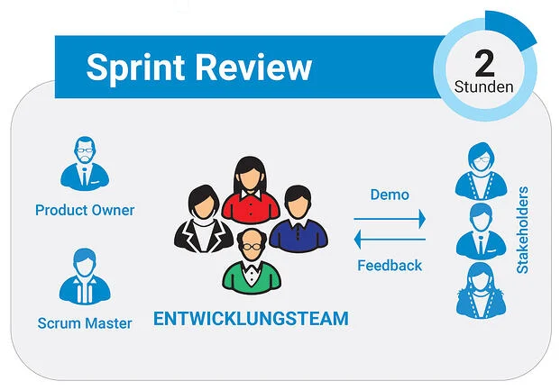

# Überblick

Immer öfter neigen Unternehmen dazu, Projekte anhand des agilen Projektmanagements durchzuführen und sich die dafür erforderlichen Kompetenzen anzueignen. Hintergrund
des agilen Managements und deren Kernpunkte sind es, dass es Projekten und Prozessen *breiteren Raum an Flexibilität* bietet, was es möglich macht, *schneller und
effektiver* auf Veränderungen einzugehen.[^1]

# Historischer Hintergrund

Eine Methodik, welche das agile Konzept verfolgt, ist Scrum. Diese hat ihren Ursprung in den frühen 90er Jahren und wurde primär als Entwicklungsmethodik für Software
eingeführt.[^2]  

Der Scrum Prozess lässt sich in diverse Elemente aufteilen[^3]. Darunter fallen:

1. Ereignisse
2. an dem Prozess beteiligte Personen
3. daraus resultiernde Ergebnisse

# Sprints

Kernelemente der Ereignisse sind die sogenannten Sprints, welche einen hohen Stellenwert einnehmen und dementsprechend *"der Herzschlag von Scrum ist, wo Ideen in Wert
umgewandelt werden"*[^4] [scrum guide poster]
  Taucht man nun tiefer in den Ablauf eines einzigen Sprints ein, lässt sich feststellen, dass dieser nochmals in Etappen unterteilt ist.
  

# Sprint Review

Sprint Retrospective, Sprint Review, Sprint Planning und Daily Scrum sind die Bausteine und ergeben zusammen einen Sprint. Dabei wird immer wieder der gleiche Ablauf
befolgt, wobei der Sprint Review vor der Sprint Retrospective stattfindet. [scrum guide poster]

Während der Phase des Sprint Reviews kommt dann das ganze Scrum Team zusammen, die dort die Möglichkeit haben Feedback zu geben. Diese Gruppe besteht demnach aus dem
Product Owner, dem Scrum Master und dem Entwickler Team. Zudem sollte idealerweise auch der Stakeholder hinzugezogen werden; dies kann zum Beispiel ein Anwender, ein
Manager oder ein Vertreter aus diversen Bereichen sein.

## Ablauf eines Sprint Reviews

Üblicherweise dauert ein solches Meeting circa vier Stunden, sollten die Sprints aber kürzer sein, fällt auch die Dauer der Besprechung dementsprechend knapper aus[^2].
Was auch bereits im darunterstehenden Bild illustriert wurde, soll im Folgenden noch genauer erläutert werden:

### Folgeschritte[^5]

* __Allgemeine Regeln__
  - Begonnen wird im Sprint Review meist damit, dass der Product Owner allgemeine Regeln über den Ablauf des Sprint Reviews aufstellt und Erwartungen hieran mitteilt
 
* __Überblick__
  - Weiterführend informiert er in einem kurzen Überblick darüber, was demonstriert werden soll und was der Inhalt des heutigen Meetings ist
  
* __aktueller Stand__
  - Außerdem berichtet er, was bereits erreicht worden ist und welche Aufgaben noch abgeschlossen werden müssen
  
* __Demonstration durch das Scrum Team__
  - Nachdem durch den Product Owner ein Gesamtüberlick geliefert wurde, geht das Scrum Team zum einen darauf ein, welche Fortschritte und Ergebnisse jeder einzelne im
    Team erreicht hat und zum anderen in welchen Bereichen Probleme aufgetreten sind und wie diese gelöst wurden. Dabei stehen sie natürlich stets für Fragen zur 
    Verfügung
    
* __Wertschätzung des Geschafften__
  - Hierbei bietet es sich an das Team für seine Arbeit zu loben und einen Dank auszusprechen
  
* __Änderungen am Product Backlog__
  - Gegebenenfalls werden dann zusätzlich Änderungen des Product Backlogs, was eine Auflistung aller Anforderungen für ein zu erstellendes Produktes enthält, besprochen
 
* __Diskussion__
  - Dies wird nicht selten in Form einer Diskussion erarbeitet, in der alle Anwesenden ihre Änderungsvorschläge anbringen können und somit einzelne Teile überarbeitet
    werden. Das wird stets in Anwesenheit des Stakeholders passieren, sodass auch dieser in der Lage ist mögliche Wünsche oder Abneigungen kundzutun
 
* __Erstellung der Inhalte__
   - Auf Grundlage des angepassten Product Backlogs werden schlussendlich die Inhalte des nächsten Sprints bestimmt

# Fazit

Demnach beinhaltet ein Sprint den Sprint Review, welcher nochmals in mehrere Bestandteile aufgegliedert werden kann. Schlüsselelement dabei ist vor allem die Demo des
Entwicklerteams, auf welche dann ein Feedback der Anwesenden folgt. Dies geschieht immer im Hinblick auf die Anpassung des Product Backlogs und der kontinuierlichen
Fortschritte des Produktes in Richtung des vorgegebenen Ziels.[^6]

# Siehe auch

* Verlinkungen zu angrenzenden Themen
* [Link zu den Grundlagen des Sprints](Sprint.md)
* [Link zum Product Backlog](Product_Backlog.md)

# Weiterführende Literatur

* Weiterfuehrende Literatur über das "Konzept" *Scrum*: Scrum: The Art of Doing Twice the Work in Half the Time 

# Quellen

[^1]: https://www.factro.de/blog/agiles-projektmanagement
[^2]: https://scrumguide.de/die-geschichte-von-scrum/
[^3]: https://www.appvizer.de/magazin/organisation-planung/projektmanagement/scrum-artefakte
[^4]: https://th.bing.com/th/id/R.76d74b272367227af5940a48d6c786d8?
rik=ed955fWu7mgGwQ&riu=http%3a%2f%2fimg.selzstatic.com%2fitems%2f151237%2fyeehcvd3qld%2foriginal.png%3fw%3d1600%26fit%3dmin&ehk=CJg58oCI6zYMF4aadVPeWyF1RVH7DeyDTWrFtd8q%
2bnY%3d&risl=&pid=ImgRaw&r=0
[^5]: https://www.agile-academy.com/de/product-owner/eine-agenda-fuer-das-sprint-review/
[^6]: https://scrumguides.org/docs/scrumguide/v2020/2020-Scrum-Guide-German.pdf

