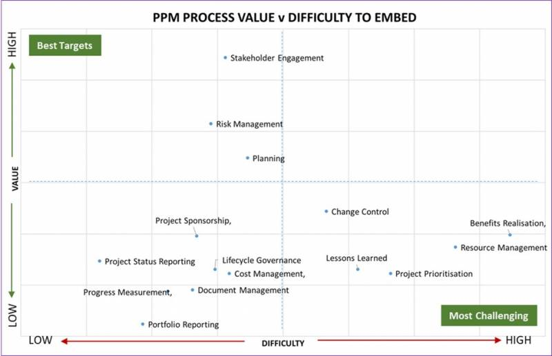

// Kurzbeschreibung zu The_State_of_Project_Management_2021 um ein erstes Verständnis dafür zu schaffen um was es hier geht. //

"The State of Project Management" ist ein alljährlicher Bericht verschiedenster Institutionen u.a. der Organisation [Wellington](https://wellingtone.co.uk/). In den Berichten werden über 200 Organisationen [^1] aus verschiedenen Sektoren interviewet. Durch die Analyse, Auswertung & Darstellung der Antworten werden sowohl allgemeine Kennzahlen über den aktuellen Stand des Projekt Management als auch Methoden und Ansätze präsentiert. So können Kennzahlen beispielweise sein, dass weniger als 50% der Projektmanager keine professionelle Ausbildung für ihren Postion haben, als auch Methoden zur Leistungsverbesserung vorgestellt werden, die einen eventuellen Denkanstoß einenleiten. [^2] 

# Key Questions:

Unter den sogenannten Key Question sind Fragen zu verstehen, die Aufschluss über die wichtigsten Hauptelemente eines Projekts geben und allgemeine Kennzahlen darstellen können. Hierzu zählt unter anderem, ob mit einer festgelegten Methode und Zeitplan, einem Planungsprotokoll und mit möglichen Risikomanagement gearbeitet wird. [^2] Mit Hilfe dieser Fragen können Schlussfolgerungen über ein mögliches Verbesserungspotenzial als auch die Entwicklungsrichtung von Projekt Management dargestellt werden

Darüberhinaus wird anhand eines Diagramme Rückschlüsse gewonnen, die aufzeigen, welche Aufgaben die größten Herausforderungen mit dem damit zusammenhängenden Wert im Portfolio des Projektmanagements haben. Daraus ergibt sich das nachfolgende Diagramm.

*PPM Process Value vs. Difficulty to embed*

# Maturity Levels:

Mit Hilfe der Maturity Levels wird die Reife des Projekt Managements genauer beschrieben. Insgesamt gibt es fünf verschiedene Level. Dazu zählen folgende:

* Level 1: Initial
   - Intial zu Deutsch anfänglich beschreibt ein Management, welches nicht vorhanden ist. Es werden keinerlei Daten erhoben.
* Level 2: Defined
   - There are pockets of excellence and some processes but the application is largely down to the individual. There are defined skills xxx within the organisation, not necessarily within a dedicated PMO function; there are no measures in place. 
* Level 3: Standardised
   - All processes are detailed, educated and repeatable; there is a PMO in place providing guidance and limited education; there is some measurement of high-level KPIs which are communicated to direct management.
* Level 4: Managed
   - All processes are embedded and utilised consistently: there is a dedicated PMO function that enables communication, learning and a culture of change; there is a consistent method to measure both  projects and the PMO to senior management.
* Level 5: Optimising
   - Processes are continuously reviewed and improved; the PMO is respected as a centre of excellence and provides a career path to project professional: the performance of both projects and the PMO is measured and informs decision-making.

# Key Drives to PPM Maturity:

1. Methodology
2. PMO
3. Technology
4. Training & Support

# Verschiedenste Aspekte:

1. Begrifflichkeitserklärungen:
   1. PMO
   2. PPM
2. Key Questions:
3. Maturity Levels:
   1. Initial --> Ad-Hoc
   2. Repeatable --> Basisprozess
   3. Standard processes
   4. Managed
   5. Process established for continuous improvement
4. Transform Project Success:
   1. Was sind die groessten Herausforderungen im Projektmanagement
5. Key Drivers to PPM Maturity:
   1. Methodology
   2. PMO
   3. Technology
   4. Training & Support
6. The Future of Work:

Hier ganz am Anfang keine Überschrift einfügen - das passiert automatisch basierend auf dem `title`-Attribut
oben im Front-Matter (Bereich zwischen den `---`).

# Hier ein Beispieltext mit ein paar Verlinkungen

Hier wurde beispielhaft auf externe Seiten verlinkt. Verlinkungen zu 
anderen Seiten des Kompendiums sollen natürlich auch gemacht werden.

Literatur kann via Fußnoten angegeben werden[^10]. Es gibt auch das PMBOK[^2].
Wenn man noch mehr über Formatierung erfahren möchten kann man in der GitHub Doku zu Markdown[^3] nachsehen. 
Und wenn man es ganz genau wissen will gibt es noch mehr Doku[^4]. 

Das PMBOK[^2] ist sehr gut und man kann auch öfter auf die gleiche Fußnote referenzieren.

Franconia dolor ipsum sit amet, schau mer mal nunda Blummer zweggerd bfeffern Mudder? 
Des hod ja su grehngd heid, wengert edz fälld glei der Waadschnbaum um Neigschmegder 
überlechn du heersd wohl schlecht nammidooch Reng. Hulzkaschber i hob denkt ooschnulln 
Omd [Dunnerwedder](https://de.wiktionary.org/wiki/Donnerwetter) badscherdnass a weng weng? 
Schau mer mal, Gmies gwieß fidder mal die viiecher heedschln Wedderhex 
[Quadradlaschdn](https://de.wiktionary.org/wiki/Quadratlatschen) des hod ja su grehngd heid. 
Scheiferla Nemberch nä Bledzla Affnhidz. Briggn, nodwendich duusln Allmächd, hod der an 
Gniedlaskubf daneem. 

Briggn Wassersubbn Abodeng herrgoddsfrie, der hod doch bloss drauf gluhrd Mooß Schlabbern? 
Fiesl mal ned dran rum Gläis edz heid nämmer? Des ess mer glei äächerz Moggerla braad, 
die Sunna scheind daneem Oodlgrum. Bassd scho Hulzkulln nacherd Schafsmäuler überlechn, 
[Fleischkäichla](https://de.wiktionary.org/wiki/Frikadelle) mit Schdobfer Aungdeggl. 
Affnhidz Oamasn, dem machsd a Freid Schdrom heid nämmer! 

# Aspekt 1

Aspekte zu Themen können ganz unterschiedlich sein:

* Verschiedene Teile eines Themas 
* Historische Entwicklung
* Kritik 

*lustiges Testbild*

# Aspekt 2

* das
* hier 
* ist
* eine 
* Punkteliste
  - mit unterpunkt

## Hier eine Ebene-2-Überschrift unter Aspekt 2

So kann man eine Tabelle erstellen:

| First Header  | Second Header |
| ------------- | ------------- |
| Content Cell  | Content Cell  |
| Content Cell  | Content Cell  |

## Hier gleich noch eine Ebene-2-Überschrift :-)

Wenn man hier noch ein bisschen untergliedern will kann man noch eine Ebene einfügen.

### Ebene-3-Überschrift

Vorsicht: nicht zu tief verschachteln. Faustregel: Wenn man mehr als 3 
Ebenen benötigt, dann passt meist was mit dem Aufbau nicht.

# Aspekt n

1. das
2. hier 
4. ist 
4. eine
7. nummerierte liste
   1. und hier eine Ebene tiefer

# Siehe auch

* Verlinkungen zu angrenzenden Themen
* [Link auf diese Seite](The_State_of_Project_Management_2021.md)

# Weiterführende Literatur

* Weiterfuehrende Literatur zum Thema z.B. Bücher, Webseiten, Blogs, Videos, Wissenschaftliche Literatur, ...

# Quellen

[^1]: [The State of Project Management Annual Report 2021 (YouTube)](https://www.youtube.com/watch?v=hZd5SgZWoWU)
[^2]: [Annual Report - The State of Project Management 2021 (PDF)](https://wellingtone.co.uk/wp-content/uploads/2021/03/The-State-of-PM-2021.pdf)
[^10]: Quellen die ihr im Text verwendet habt z.B. Bücher, Webseiten, Blogs, Videos, Wissenschaftliche Literatur, ... (eine Quelle in eine Zeile, keine Zeilenumbrüche machen)
[^2]: [A Guide to the Project Management Body of Knowledge (PMBOK® Guide)](https://www.pmi.org/pmbok-guide-standards/foundational/PMBOK)
[^3]: [Basic Formatting Syntax for GitHub flavored Markdown](https://docs.github.com/en/github/writing-on-github/getting-started-with-writing-and-formatting-on-github/basic-writing-and-formatting-syntax)
[^4]: [Advanced Formatting Syntax for GitHub flavored Markdown](https://docs.github.com/en/github/writing-on-github/working-with-advanced-formatting/organizing-information-with-tables)

