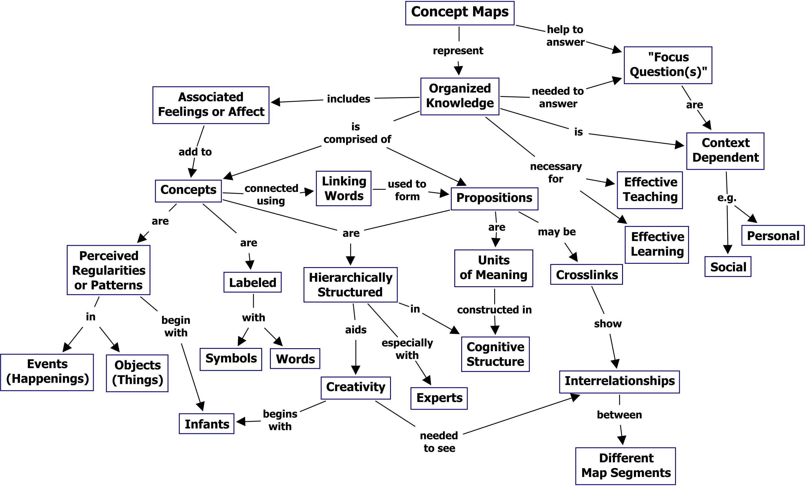

Ein Unternehmen[^1], viele Standorte und eine große Mitarbeiterzahl. Unter diesen Umständen kann sich sehr schnell viel Wissen ansammeln und die Herausforderung besteht dann darin, den Überblick beizubehalten und Transparenz zu schaffen. 
In diesem Beitrag wird es um sogenannte „Wissenslandkarten“ gehen. 
Sie ermöglichen den Überblick über die unterschiedlichsten Wissensgebiete und deren Zusammenhänge und eignen sich besonders dafür Arbeitsverläufe effektiver und effizienter dazustellen. Sie referenzieren auf Experten-, Team-, Mitarbeiterwissen, Wissensentwicklungsphasen und organisatorische Abläufe und Fähigkeiten. Wichtig zu erwähnen ist, dass die Wissensinhalte an sich nicht dort abgelegt werden, sondern lediglich der Verweis auf das verankerte Wissen. 

# Inhaltsverzeichnis

1. Begriffserklärung
2. Arten von Wissenslandkarten                 
3. Vor- und Nachteile
   1. Vorteile
   2. Nachteile

## 1. Begriffserklärung

*„Knowledge is a valuable asset, but not if you can't find it when you need it. Increasingliy, organizations are creating "maps" of their intellectual assets and letting them guide the way.“* - (C. Hildebrand[^2])

Das Strukturieren von Wissen ist, nach Golinsky[^3], essenziell. In einem Unternehmen kommen die unterschiedlichsten Mitarbeiter mit den verschiedensten Fähigkeiten zusammen.  Eine Folge hiervon ist die Bildung eines großen und meist unstrukturierten Pools an Wissen.  
Zum Erhalt der Wettbewerbs- und Innovationsfähigkeit von Unternehmen spielt das Wissenskapital einer Organisation eine gravierende Rolle. 
Um den Überblick und die Transparenz über das Wissenspotenzial der Mitarbeiter nicht aus den Augen zu verlieren, kommt das Tool des [Wissensmanagements](Wissensmanagament.md), Wissenslandkarten, in den Einsatz. *„Es sollen nicht mehr nur Elemente isoliert voneinander betrachtet werden, sondern es soll strukturelles Wissen in seiner vollen Komplexität erfasst und bewertet werden.“* - (Ott 2003[^4]).

Die Kunst besteht darin die Kernkompetenzen der Unternehmung darzustellen. 
Wissenslandkarten sind eine grafische Darstellung von Wissensgebieten und deren Zusammenhänge. Sie ermöglicht zum einen den freien Zugang auf Wissensträger und Wissensobjekte und zum anderen werden sie zur Verwaltung von Wissenskapital in Unternehmen genutzt. 
Nach Heyer[^5] ist es mit Wissenslandkarten möglich in Form eines Grafen eine Übersicht wesentlicher Schlüsselwörter einer Textsammlung und deren inhaltliche Vernetzung darzustellen. Viel wichtiger als die Strukturierung der Tiefenebenen, ist die Vermessung der unterschiedlichen Themenfelder. 
Im Folgenden ist ein Beispiel für eine Wissenslandkarte abgezeichnet.

*Wissenslandkarte[^6]*

## 2. Arten von Wissenslandkarten
Folglich werden die verschiedenen Arten von Wissenslandkarten tabellarisch aufgeführt: 

| Deutsche Bezeichnung      | Englische Bezeichnung       |  Beispiel                   |
| ----------------------    | -------------               | --------------------------  |
| Wissensträgerkarten       |  Knowledge source map       | Gelbe Seiten                |
| Wissensbestandskarten     |  Knowledge asset map        | Rechenzentrum               |
| Wissensstrukturkarten     |  Knowledge structure map    | MindMaps                    |
| Wissensanwendungskarten   |  Knowledge application map  | Geschäftsprozesse           |
| Wissensentwicklungskarten |  Knowledge development maps | Beziehungsnetze             |

*Arten von Wissenslandkarten*[^7]

## 2. Vor- und Nachteile[^8]
Es stellt sich nun die Frage: 
Lohnt sich die Einführung von Wissenslandkarten oder wäre dies nur eine reine Zeitverschwendung?

### Vorteile 

- Strukturierung von Wissensquellen
- Optimale Ausschöpfung der Wissensressourcen
- Darstellung von Wissen um Überblick
- Schaffung von Ordnung 
- Erkennung von Themengebiete und Ansprechpartner 
- Erleichterte Erschließung von Wissen 
- Schnelle und effektive Aneignung und Findung von neuem Wissen
- Transparenz und freier Zugang zu Informationen für alle Mitarbeiter
- Erkennung der Kernkompetenzen 
- Identifikation des Unternehmens 
- Direkte Umsetzung der Kompetenzen in Projekte 
- Übersichtliche Darstellung von Texten 
- Einfachere Einarbeitung neuer Mitarbeiter
- Kontakt zu Experten 
- Kosten- und Zeitvorteil

### Nachteile

- Überflutung von Informationsanfragen
- Gefahr der Überstreitung der Privatsphäre der Mitarbeiter
- Wahrung des Betriebsgeheimnisses  
- Durch grafische Darstellung, keine dynamischen Aspekte möglich
- Fehlende automatische Aktualisierung des neu erlernten Wissens
- Aufwendige Erstellung einer Wissenslandkarte
- Hohe Produktions- und Wartungskosten

# Siehe auch

* [Wissensmanagement](Wissensmanagament.md)
* [Wissensspirale](Wissensspirale.md)
* [Wissensmarkt](Wissensmarkt.md)
* [Wissenstransfer](Wissenstransfer.md)

# Weiterführende Literatur

* Hildebrand, 1998: Mapping the Invisible Workplace
* [Wissenslandkarte](https://wiki.cogneon.de/Wissenslandkarte)
* Lorenz, 2012: Wissenslandkarten, Wirtschaftsinformatik (Master)

# Quellen

[^1]: [Unternehmen](https://de.wikipedia.org/wiki/Unternehmen)
[^2]: Hildebrand, 1998: Mapping the Invisible Workplace
[^3]: [Agile Verwaltung](https://agile-verwaltung.org/tag/wissenslandkarte/)
[^4]: [Wissenslandkarten als Instrument des kollektiven Wissensmanagements](http://fhib5jg.factlink.net/fsDownload/DA_Wissenslandkarten.pdf?forumid=286&v=1&id=166113)
[^5]: [Charakterisierung biologisch relevanter Texte anhand von Wissenslandkarten](https://monami.hs-mittweida.de/frontdoor/deliver/index/docId/1919/file/BA_Tina_Giersch.pdf)
[^6]: [Wissenslandkarte](Wissenslandkarte/Wissenslandkarte.png)
[^7]: [Verschiedenen Arten von Wissenslandkarten](https://de.wikipedia.org/wiki/Wissenslandkarte)
[^8]: [Vor- und Nachteile](https://www.enzyklopaedie-der-wirtschaftsinformatik.de/lexikon/daten-wissen/Wissensmanagement/Wissensorganisation--Instrumente-der-/Wissenslandkarte)

